# Software Requirements Specification (SRS)
## Supporting Tool for Requirements and Project Progress Management in SWP391 Using Jira and GitHub (SWP Tracker)

**Version:** 1.0  
**Date:** 2026-03

---

## II. Product Overview

### II.1 Problem Description

**SWP Tracker** là phần mềm hỗ trợ quản lý yêu cầu và tiến độ dự án phần mềm cho môn học SWP391. Hệ thống thay thế quy trình thủ công trong việc tổng hợp yêu cầu từ Jira, theo dõi công việc (tasks), đồng bộ commit từ GitHub, và tạo tài liệu SRS/báo cáo tiến độ cho giảng viên.

Bối cảnh: Trong đào tạo ngành Kỹ thuật Phần mềm, Jira thường dùng để quản lý yêu cầu và công việc, GitHub dùng để quản lý mã nguồn. Sinh viên gặp khó khăn khi: (1) Tạo tài liệu SRS có hệ thống từ yêu cầu trên Jira; (2) Tổng hợp báo cáo phân công và thực hiện công việc theo nhóm; (3) Tổng hợp báo cáo commit trên GitHub để phản ánh đóng góp cá nhân. SWP Tracker kết nối với Jira Cloud REST API và GitHub REST API, lưu trữ dữ liệu nội bộ (nhóm, task, commit, báo cáo) và cung cấp giao diện theo vai trò (Admin, Lecturer, Team Leader, Team Member).

**Context Diagram (mô tả):** Hệ thống SWP Tracker nằm ở trung tâm, có luồng dữ liệu với: **Administrator**, **Lecturer**, **Team Leader**, **Team Member**, **Jira Cloud**, **GitHub**. (Vẽ hình: hộp trung tâm "SWP Tracker", xung quanh các terminators với mũi tên dữ liệu vào/ra.)

---

### II.2 Major Features

| ID | Feature | Mô tả |
|----|---------|--------|
| FE-01 | Quản lý nhóm (Groups) | CRUD nhóm; cấu hình Jira Project Key, GitHub Repo; gán thành viên. |
| FE-02 | Quản lý giảng viên | Admin tạo/xóa lecturer; gán lecturer vào nhóm (GroupLecturer). |
| FE-03 | Đồng bộ Jira | Team Leader/Admin đồng bộ issues từ Jira vào bảng Tasks. |
| FE-04 | Quản lý công việc (Tasks) | Tạo task, gán người, cập nhật trạng thái (Todo/In Progress/Done). |
| FE-05 | Tạo SRS | Tạo tài liệu SRS từ Groups, Tasks, Users; tải xuống .txt. |
| FE-06 | Đồng bộ GitHub | Đồng bộ commits từ repo vào bảng Commits. |
| FE-07 | Thống kê commit & báo cáo | commit-stats, commits-by-week, progress, personal-stats. |
| FE-08 | Xác thực & phân quyền | Login (Cookie/JWT), 4 role: Admin, Lecturer, TeamLeader, TeamMember. |

---

### II.3 Context Diagram

Hệ thống **SWP Tracker** ở trung tâm; các thực thể ngoài: Administrator, Lecturer, Team Leader, Team Member, Jira Cloud, GitHub. Mỗi thực thể nối với hệ thống bằng **nhiều mũi tên** gắn nhãn luồng dữ liệu cụ thể (giống mẫu Context Diagram: từng luồng vào/ra được mô tả riêng).


*Hình: Context Diagram – SWP Tracker và các luồng dữ liệu chi tiết.*

**Sơ đồ dạng Mermaid (nhiều mũi tên có nhãn):**

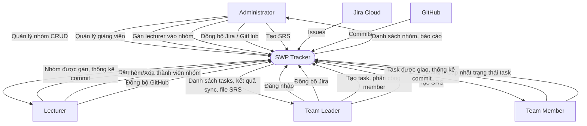

**Bảng luồng dữ liệu (Data flows):**

| Thực thể | Hướng | Luồng dữ liệu |
|----------|--------|----------------|
| **Administrator** | → Hệ thống | Quản lý nhóm (CRUD), Quản lý giảng viên, Gán lecturer vào nhóm, Đồng bộ Jira/GitHub, Tạo SRS |
| **Administrator** | ← Hệ thống | Danh sách nhóm, báo cáo |
| **Lecturer** | → Hệ thống | Đăng nhập, Thêm/Xóa thành viên nhóm, Đồng bộ GitHub |
| **Lecturer** | ← Hệ thống | Nhóm được gán, thống kê commit |
| **Team Leader** | → Hệ thống | Đăng nhập, Đồng bộ Jira, Tạo task / phân công member, Tạo SRS |
| **Team Leader** | ← Hệ thống | Danh sách tasks, kết quả sync, file SRS |
| **Team Member** | → Hệ thống | Đăng nhập, Cập nhật trạng thái task |
| **Team Member** | ← Hệ thống | Task được giao, thống kê commit |
| **Jira Cloud** | → Hệ thống | Issues |
| **GitHub** | → Hệ thống | Commits |

---

### II.4 Nonfunctional Requirements

| # | Feature | System Function | Description |
|---|---------|-----------------|-------------|
| 1 | Authentication | Cookie Authentication | Login MVC, session cookie cho Dashboard. |
| 2 | Authentication | JWT Bearer | API dùng JWT cho SPA/client. |
| 3 | Authorization | RBAC | 4 role; [Authorize(Roles = "...")] trên API và trang. |
| 4 | Integration | Jira Cloud REST API | GET /rest/api/3/search; sync issues → Tasks. |
| 5 | Integration | GitHub REST API | GET /repos/.../commits; sync → CommitRecord. |
| 6 | Data | EF Core + SQL Server | DbContext: Groups, GroupLecturers, Tasks, Commits, Reports, Identity. |
| 7 | Data | Seed | SeedExtensions: roles, users, groups, tasks, commits, reports. |

---

### II.5 Functional Requirements

#### II.5.1 Actors

| # | Actor | Description |
|---|-------|-------------|
| 1 | Administrator | Quản lý nhóm, giảng viên, gán GV–nhóm, Sync Jira/GitHub, Tạo SRS, xem Commits. |
| 2 | Lecturer | Xem nhóm được gán, thêm/xóa thành viên nhóm, xem requirements/tasks, báo cáo, thống kê commit, sync GitHub. |
| 3 | Team Leader | Xem nhóm mình, quản lý tasks, đồng bộ Jira, tạo SRS, xem commit. |
| 4 | Team Member | Xem/cập nhật task được giao, xem commit cá nhân. |

#### II.5.2 Use Cases

| ID | Use Case | Actors |
|----|----------|--------|
| UC-01 | Đăng nhập / Đăng xuất | All |
| UC-02 | Quản lý nhóm (CRUD) | Administrator |
| UC-03 | Quản lý giảng viên | Administrator |
| UC-04 | Gán giảng viên vào nhóm | Administrator |
| UC-05 | Thêm/Xóa thành viên nhóm | Administrator, Lecturer |
| UC-06 | Đồng bộ Jira | Team Leader, Administrator |
| UC-07 | Quản lý công việc (tạo task, xem) | Team Leader, Administrator |
| UC-08 | Cập nhật trạng thái task | Team Member, Team Leader, Administrator |
| UC-09 | Tạo SRS | Team Leader, Administrator |
| UC-10 | Đồng bộ GitHub commits | Lecturer, Team Leader, Administrator |
| UC-11 | Xem thống kê commit / báo cáo | Lecturer, Team Leader, Administrator, Team Member |

#### II.5.2.1 Diagram(s)

**Sơ đồ Use Case (hình vẽ)**


*Hình: Use Case Diagram – Actors và Use Cases.*

---

Các sơ đồ Use Case dưới đây (Mermaid) thể hiện chi tiết quan hệ giữa Actor và Use Case (ai thực hiện use case nào) và quan hệ giữa các Use Case (include/extend). Có thể vẽ lại trong Word, draw.io hoặc công cụ UML; dưới đây dùng Mermaid để minh họa (có thể render tại [Mermaid Live](https://mermaid.live) hoặc VS Code với extension Mermaid).

**Diagram 1 – Tổng quan Actor – Use Case (hệ thống SWP Tracker)**

Mỗi actor (Administrator, Lecturer, Team Leader, Team Member) được nối với các use case mà actor đó thực hiện.

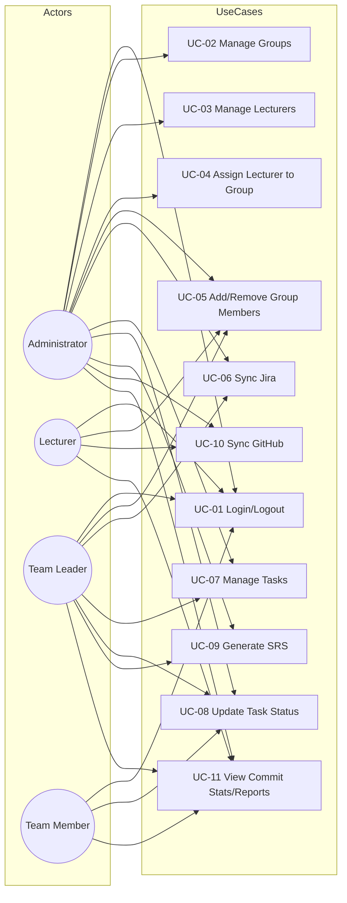

**Diagram 2 – Phân theo từng Actor (4 sơ đồ con)**

*Administrator – các use case*

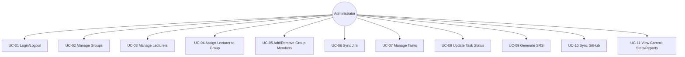

*Lecturer – các use case*

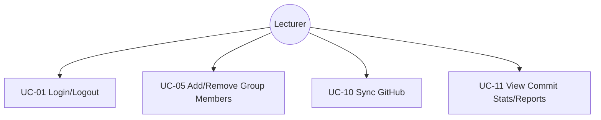

*Team Leader – các use case*

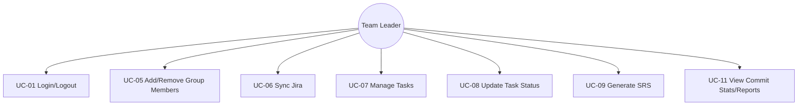

*Team Member – các use case*

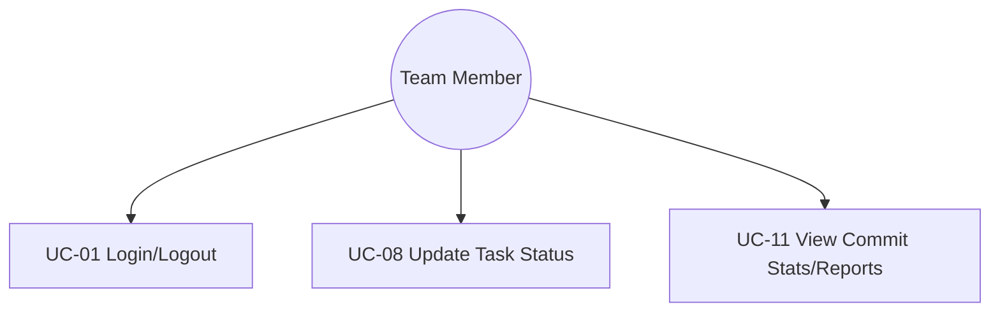

**Diagram 3 – Quan hệ UC–UC (include)**

Use case **UC-01 Đăng nhập** được coi là <<include>> bởi các use case khác (trước khi thực hiện bất kỳ UC nào trong hệ thống, user phải đăng nhập). **UC-09 Tạo SRS** sử dụng dữ liệu từ nhóm và công việc (có thể xem như phụ thuộc vào thông tin từ UC-02/UC-07 trong ngữ cảnh dữ liệu).

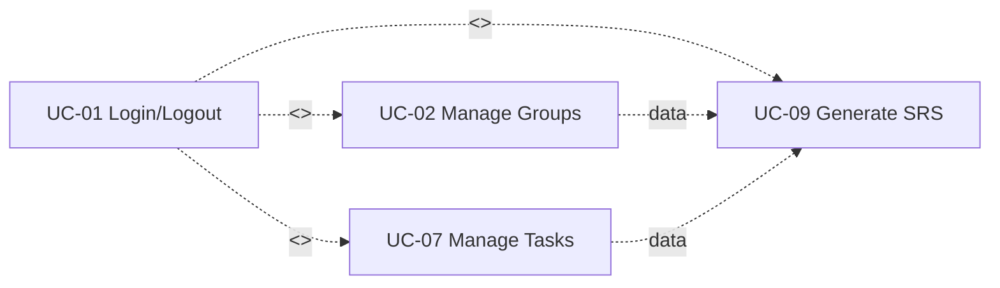

**Ghi chú khi vẽ lại trong Word/draw.io:**

- **Actor:** vẽ hình “stick figure” (người que) hoặc hộp với tên; đặt bên trái hoặc bên phải hệ thống.
- **Use case:** vẽ hình oval (elip), bên trong ghi tên use case (động từ + tên đối tượng).
- **Hệ thống:** có thể vẽ một hình chữ nhật bao quanh các use case (boundary).
- **Quan hệ Association:** đường thẳng nối Actor với Use case mà actor đó thực hiện.
- **<<include>>:** mũi tên nét đứt từ use case A sang use case B, ghi «include» — A luôn gọi B.
- **<<extend>>:** (nếu có) mũi tên nét đứt từ use case mở rộng sang use case gốc, ghi «extend» — điều kiện mở rộng.

**Mô tả mẫu – UC-06 Đồng bộ Jira:** User chọn nhóm → bấm Đồng bộ → POST /api/jira/sync?groupId=... → JiraService gọi Jira API, map issues → TaskItem, lưu DB → trả về added, updated.

**Mô tả mẫu – UC-09 Tạo SRS:** User chọn nhóm → bấm Tạo SRS → POST /api/reports/srs?groupId=... → load Group, Tasks (Include AssigneeUser), tạo nội dung SRS, lưu Report → trả về Id, link tải.

#### II.5.2.2 Use Case Descriptions

Bảng tổng hợp và mô tả chi tiết từng use case theo template Functional Description.

**Bảng Use Cases**

| ID | Use Case | Actors | Use Case Description |
|----|----------|--------|----------------------|
| 01 | Đăng nhập / Đăng xuất | Administrator, Lecturer, Team Leader, Team Member | User nhập email/mật khẩu; hệ thống xác thực và tạo session (Cookie) hoặc trả JWT; đăng xuất hủy session. |
| 02 | Quản lý nhóm (CRUD) | Administrator | Tạo, xem, sửa, xóa nhóm; cấu hình Code, Name, JiraProjectKey, GitHubRepo. |
| 03 | Quản lý giảng viên | Administrator | Tạo/xóa tài khoản lecturer; quản lý danh sách giảng viên. |
| 04 | Gán giảng viên vào nhóm | Administrator | Gán hoặc bỏ gán lecturer vào nhóm (bảng GroupLecturer). |
| 05 | Thêm/Xóa thành viên nhóm | Administrator, Lecturer | Thêm user vào nhóm hoặc xóa user khỏi nhóm (cập nhật GroupId của user). |
| 06 | Đồng bộ Jira | Team Leader, Administrator | Chọn nhóm, gọi sync; hệ thống gọi Jira API, map issues → TaskItem, lưu DB; trả số added/updated. |
| 07 | Quản lý công việc (tạo task, xem) | Team Leader, Administrator | Tạo task thủ công, xem danh sách tasks theo nhóm, phân công member vào task. |
| 08 | Cập nhật trạng thái task | Team Member, Team Leader, Administrator | Chọn task, đổi trạng thái (Todo / In Progress / Done); member chỉ sửa task được giao cho mình. |
| 09 | Tạo SRS | Team Leader, Administrator | Chọn nhóm, tạo SRS từ Group + Tasks; hệ thống lưu Report, trả link tải. |
| 10 | Đồng bộ GitHub commits | Lecturer, Team Leader, Administrator | Chọn nhóm, đồng bộ commits từ GitHub repo vào bảng Commits. |
| 11 | Xem thống kê commit / báo cáo | Lecturer, Team Leader, Administrator, Team Member | Xem commit stats, commits-by-week, progress, personal-stats theo role và nhóm. |

---

**1 <<UC-01_Đăng nhập / Đăng xuất>>**

| Field | Nội dung |
|-------|----------|
| **UC ID and Name** | UC-01 Đăng nhập / Đăng xuất |
| **Created By** | SWP Tracker Team |
| **Date Created** | 2026-03 |
| **Primary Actor** | User (Administrator, Lecturer, Team Leader, Team Member) |
| **Secondary Actors** | — |
| **Trigger** | User mở trang login hoặc gọi API login; hoặc user bấm Đăng xuất. |
| **Description** | User đăng nhập bằng email và mật khẩu; hệ thống xác thực và tạo session (Cookie cho MVC) hoặc trả JWT (cho API). Sau đăng nhập, chuyển hướng theo role. Đăng xuất hủy session. |
| **Preconditions** | PRE-1: Hệ thống đã có tài khoản (seed hoặc đăng ký). PRE-2: Trình duyệt/client cho phép Cookie (nếu dùng Cookie). |
| **Postconditions** | POST-1: User đã được xác thực; session hoặc token có hiệu lực. POST-2: (Logout) Session/token đã bị hủy. |
| **Normal Flow** | 1.0 User mở /login. 2.0 User nhập email, mật khẩu (và có thể chọn "Remember me"). 3.0 User gửi form. 4.0 Hệ thống kiểm tra email tồn tại, kiểm tra mật khẩu. 5.0 Hệ thống tạo Claims (NameIdentifier, Role, Email), SignInAsync Cookie (hoặc trả JWT nếu API). 6.0 Hệ thống chuyển hướng đến Dashboard; Dashboard redirect theo role (Admin/Lecturer/TeamLeader/TeamMember). |
| **Alternative Flows** | 1.1 (API login): Client gửi POST /api/auth/login với email, password; hệ thống trả JWT và role, email. 2.1 (Logout): User gửi POST /logout (Cookie) hoặc client xóa JWT và gọi POST /api/auth/logout. |
| **Exceptions** | 1.0.E1: Email hoặc mật khẩu trống → hiển thị "Vui lòng nhập email và mật khẩu." 1.0.E2: Email không tồn tại hoặc mật khẩu sai → "Email hoặc mật khẩu không đúng." |
| **Priority** | Must Have, High |
| **Frequency of Use** | Mỗi phiên làm việc (đăng nhập 1 lần; đăng xuất khi kết thúc). |
| **Business Rules** | BR-Auth: Đăng nhập bằng email; role xác định trang đích. |
| **Other Information** | AccountController (Cookie); AuthController (JWT). Hybrid scheme: API chấp nhận Cookie + JWT. |
| **Assumptions** | User có email và mật khẩu đúng; Identity đã cấu hình (PasswordHasher, Cookie/JWT options). |

---

**2 <<UC-06_Đồng bộ Jira>>**

| Field | Nội dung |
|-------|----------|
| **UC ID and Name** | UC-06 Đồng bộ Jira |
| **Created By** | SWP Tracker Team |
| **Date Created** | 2026-03 |
| **Primary Actor** | Team Leader hoặc Administrator |
| **Secondary Actors** | Jira Cloud (external system) |
| **Trigger** | User chọn nhóm trên trang Sync và bấm "Đồng bộ ngay". |
| **Description** | Hệ thống gọi Jira Cloud REST API (search issues theo project key của nhóm), map issues sang TaskItem, lưu hoặc cập nhật vào DB; trả số bản ghi thêm và cập nhật. |
| **Preconditions** | PRE-1: User đã đăng nhập với role Team Leader hoặc Admin. PRE-2: Nhóm đã có JiraProjectKey. PRE-3: Cấu hình Jira (BaseUrl, Email, ApiToken) hợp lệ. |
| **Postconditions** | POST-1: Bảng Tasks có thêm/cập nhật các bản ghi tương ứng issues Jira của nhóm. POST-2: User thấy thông báo added, updated. |
| **Normal Flow** | 1.0 User vào trang Đồng bộ Jira. 2.0 User chọn nhóm từ danh sách. 3.0 User bấm "Đồng bộ ngay". 4.0 Hệ thống gọi JiraController.Sync(groupId). 5.0 Hệ thống lấy Group, gọi JiraService.SyncProjectIssuesToTasksAsync. 6.0 JiraService gọi GET /rest/api/3/search?jql=project=KEY, map issues → TaskItem (key, summary, status, assignee). 7.0 Hệ thống upsert Tasks (Add hoặc Update), SaveChangesAsync. 8.0 Hệ thống trả { added, updated }; trang hiển thị kết quả. |
| **Alternative Flows** | 2.1 Nhóm chưa có JiraProjectKey: hiển thị thông báo cần cấu hình. |
| **Exceptions** | 1.0.E1: groupId không tồn tại → 404. 1.0.E2: Jira API lỗi (401, 403, timeout) → hiển thị "Đồng bộ thất bại." / message từ API. |
| **Priority** | Must Have, High |
| **Frequency of Use** | Vài lần mỗi tuần khi cập nhật backlog từ Jira. |
| **Business Rules** | BR-Jira: Chỉ sync issues của project tương ứng JiraProjectKey của nhóm. |
| **Other Information** | JiraController, JiraService; appsettings Jira:BaseUrl, Email, ApiToken. |
| **Assumptions** | Jira Cloud REST API khả dụng; token có quyền read project/issues. |

---

**3 <<UC-08_Cập nhật trạng thái task>>**

| Field | Nội dung |
|-------|----------|
| **UC ID and Name** | UC-08 Cập nhật trạng thái task |
| **Created By** | SWP Tracker Team |
| **Date Created** | 2026-03 |
| **Primary Actor** | Team Member (hoặc Team Leader, Administrator) |
| **Secondary Actors** | — |
| **Trigger** | User (Member/Leader/Admin) chọn trạng thái mới (Todo / Working / Done) cho một task trên giao diện. |
| **Description** | User gửi yêu cầu cập nhật trạng thái task; hệ thống kiểm tra quyền (Team Member chỉ được sửa task mà mình là assignee), cập nhật Status và UpdatedAt, lưu DB; trả TaskResponse hoặc 403. |
| **Preconditions** | PRE-1: User đã đăng nhập. PRE-2: Task tồn tại. PRE-3: Nếu user là Team Member thì task.AssigneeUserId = currentUser.Id. |
| **Postconditions** | POST-1: Task.Status và Task.UpdatedAt đã được cập nhật trong DB. POST-2: Client nhận 200 + TaskResponse hoặc 403 + message. |
| **Normal Flow** | 1.0 User xem danh sách task (của nhóm hoặc task được giao cho mình). 2.0 User chọn trạng thái mới từ dropdown (Todo / Working / Done). 3.0 Client gửi PUT /api/tasks/{id}/status với body { "status": 0|1|2 }. 4.0 Hệ thống load task, kiểm tra role: nếu Team Member thì kiểm tra task.AssigneeUserId == currentUser.Id. 5.0 Hệ thống gán task.Status = req.Status, task.UpdatedAt = UtcNow, SaveChangesAsync. 6.0 Hệ thống trả 200 và TaskResponse; client cập nhật UI. |
| **Alternative Flows** | 2.1 Team Leader / Admin: không kiểm tra assignee, luôn được cập nhật bất kỳ task nào. |
| **Exceptions** | 1.0.E1: Task không tồn tại → 404. 1.0.E2: Team Member sửa task không phải của mình → 403, message "Bạn chỉ được cập nhật task được giao cho mình." |
| **Priority** | Must Have, High |
| **Frequency of Use** | Nhiều lần mỗi ngày khi member/leader cập nhật tiến độ. |
| **Business Rules** | BR-Task: Team Member chỉ được cập nhật trạng thái task có AssigneeUserId = currentUser. |
| **Other Information** | TaskController.UpdateStatus; TaskItemStatus enum (Todo=0, InProgress=1, Done=2). |
| **Assumptions** | Client gửi đúng task Id và giá trị status hợp lệ. |

---

**4–11. Các Use Case còn lại (tóm tắt theo template)**

Với các UC còn lại (UC-02, UC-03, UC-04, UC-05, UC-07, UC-09, UC-10, UC-11), cấu trúc mô tả giống bảng trên; dưới đây chỉ ghi **UC ID and Name**, **Primary Actor**, **Trigger**, **Description**, **Normal Flow** (số bước chính), **Priority**.

| UC | Name | Primary Actor | Trigger | Description | Normal Flow (tóm tắt) | Priority |
|----|------|---------------|---------|-------------|------------------------|----------|
| UC-02 | Quản lý nhóm (CRUD) | Administrator | Vào trang Groups, bấm Thêm/Sửa/Xóa | CRUD nhóm (Code, Name, JiraProjectKey, GitHubRepo) | Chọn thao tác → nhập dữ liệu → gửi POST/PUT/DELETE /api/groups → hệ thống validate (trùng Code) → lưu | Must Have |
| UC-03 | Quản lý giảng viên | Administrator | Vào trang Lecturers, tạo/xóa lecturer | Tạo hoặc xóa tài khoản lecturer | Gọi API Admin (create/delete user, gán role Lecturer) | Must Have |
| UC-04 | Gán giảng viên vào nhóm | Administrator | Chọn nhóm, chọn lecturer, bấm Gán/Bỏ gán | Thêm/xóa bản ghi GroupLecturer | POST/DELETE /api/admin/groups/{id}/lecturers | Must Have |
| UC-05 | Thêm/Xóa thành viên nhóm | Administrator, Lecturer | Trong trang Groups, chọn nhóm, Thêm/Xóa thành viên | Cập nhật GroupId của user (member thuộc nhóm) | GET available-users, POST/DELETE /api/groups/{id}/members | Must Have |
| UC-07 | Quản lý công việc | Team Leader, Administrator | Vào trang Tasks, Thêm task hoặc Phân công | Tạo task, xem tasks, assign member vào task | POST /api/tasks, GET /api/tasks?groupId=, PUT /api/tasks/{id}/assign | Must Have |
| UC-09 | Tạo SRS | Team Leader, Administrator | Chọn nhóm, bấm Tạo SRS | Tạo Report type SRS từ Group+Tasks, tải file | POST /api/reports/srs?groupId= → GET /api/reports/{id}?download=true | Must Have |
| UC-10 | Đồng bộ GitHub | Lecturer, Team Leader, Administrator | Chọn nhóm, bấm đồng bộ GitHub | Gọi GitHub API, map commits → CommitRecord, lưu DB | GitHubService.Sync; POST sync endpoint (nếu có) hoặc tương tự Jira | Should Have |
| UC-11 | Xem thống kê commit/báo cáo | All roles | Vào trang Commits / Reports | Xem commit-stats, commits-by-week, progress, personal-stats | GET /api/reports/commit-stats, commits-by-week, progress, personal-stats theo groupId/user | Must Have |

*Các trường Preconditions, Postconditions, Exceptions, Business Rules, Assumptions cho từng UC trên có thể bổ sung chi tiết tương tự UC-01, UC-06, UC-08 khi cần.*

#### II.5.3 Activity Diagram

Activity diagram dưới đây mô tả luồng **Quản lý công việc và cập nhật trạng thái** theo code SWP Tracker, dùng bốn swimlane: **Team Leader**, **System**, **Team Member**, **Lecturer**. Luồng bắt đầu từ Team Leader đồng bộ Jira hoặc tạo task, hệ thống validate và lưu, Team Leader phân công member, Team Member xem và cập nhật trạng thái; Lecturer xem báo cáo/tiến độ.


*Hình: II.5.3 Activity Diagram – Quản lý công việc và cập nhật trạng thái.*

**Mã Mermaid (nếu trình xem hỗ trợ Mermaid sẽ hiển thị sơ đồ; không thì dùng hình trên):**

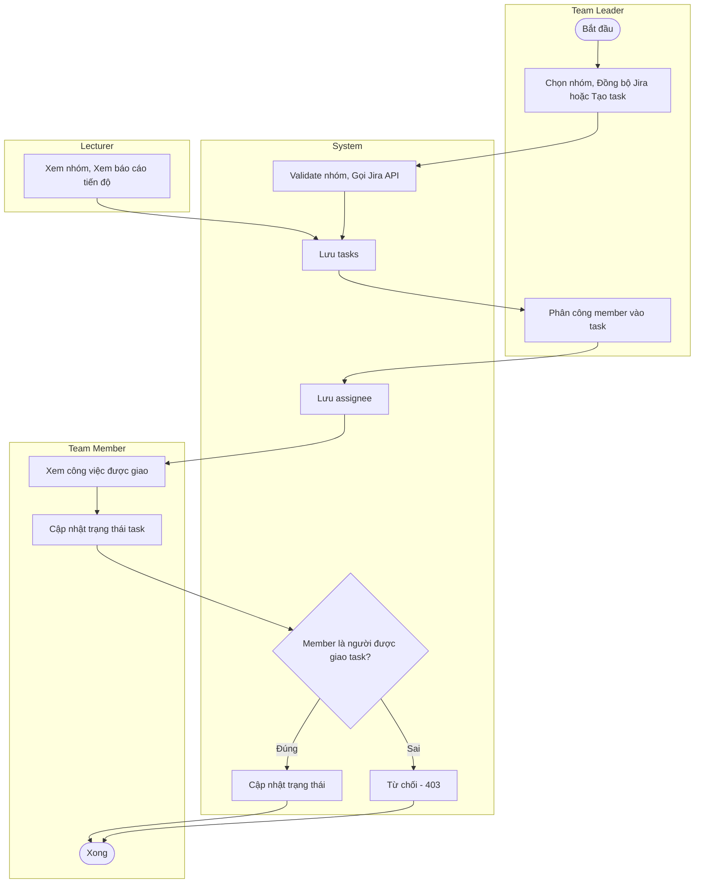

**Mô tả ngắn theo code:**

| Swimlane | Hoạt động chính | Tương ứng trong code |
|----------|-----------------|------------------------|
| **Team Leader** | Chọn nhóm, Đồng bộ Jira, Thêm task, Phân công member | Sync View → POST /api/jira/sync; Tasks View → POST /api/tasks, PUT /api/tasks/{id}/assign; GroupController, TaskController. |
| **System** | Validate nhóm, gọi JiraService, lưu TaskItem, lấy tasks, validate assignee, cập nhật status (hoặc trả 403) | JiraController.Sync → JiraService; TaskController.Create, AssignTask, UpdateStatus; AppDbContext. |
| **Team Member** | Xem công việc được giao, chọn trạng thái (Todo/Working/Done) | TeamMember View → GET /api/tasks?assigneeUserId=..., PUT /api/tasks/{id}/status. |
| **Lecturer** | Xem nhóm được gán, xem báo cáo tiến độ / Commits | Dashboard Groups, Commits; GET /api/groups, /api/reports/commits-by-week, ... |

Điều kiện rẽ nhánh: **[Member là người được giao task?]** — trong `TaskController.UpdateStatus`, nếu user là TeamMember thì chỉ cho phép sửa khi `task.AssigneeUserId == currentUser.Id`; nếu sai thì trả 403 (Từ chối cập nhật).

---

### II.6 Entity Relationship Diagram

Sơ đồ quan hệ thực thể (ERD) theo **ký hiệu Chen**: hình chữ nhật = thực thể, hình thoi = quan hệ, cardinality 1 / M trên các cạnh. User ở trung tâm, nối với Group, Task, Commit, Report và quan hệ N:N (giảng viên–nhóm).


*Hình: Entity Relationship Diagram – Ký hiệu Chen (thực thể = chữ nhật, quan hệ = thoi, 1/M).*

**Các bảng và quan hệ:**

- **AspNetUsers** (ApplicationUser): Id (PK), GroupId (FK → Groups), GitHubUsername.
- **Groups**: Id (PK), Code (unique), Name, JiraProjectKey, GitHubRepo.
- **GroupLecturers**: (GroupId, LecturerUserId) PK; FK → Groups, AspNetUsers.
- **Tasks**: Id (PK), Title, Description, Status, JiraIssueKey, AssigneeUserId (FK), GroupId (FK), CreatedAt, UpdatedAt.
- **Commits**: Id (PK), Sha, Message, AuthorName, AuthorEmail, CommittedAt, UserId (FK), GroupId (FK).
- **Reports**: Id (PK), Type, Title, Content, GroupId (FK), CreatedByUserId (FK), CreatedAt.

Quan hệ: Group 1–N Users; Group N–N Lecturers qua GroupLecturer; Group 1–N Tasks, Commits, Reports. User 1–N Tasks (assignee), 1–N Commits.

Vẽ ERD trong Word/draw.io theo các thực thể và quan hệ trên.

---

## III. Analysis Models

Interaction diagrams minh họa cách các đối tượng tương tác trong một kịch bản use case: **Sequence Diagram** nhấn mạnh thứ tự thời gian của các message; **Communication Diagram** nhấn mạnh cấu trúc và quan hệ giữa các đối tượng. State diagram mô tả các trạng thái và chuyển tiếp của đối tượng (ví dụ Task).

### III.1 Interaction Diagrams

Hai loại: **Sequence Diagram** (thứ tự thời gian message) và **Communication Diagram** (cấu trúc và quan hệ giữa các đối tượng). Dưới đây cung cấp đủ cho **11 use case**.

| UC | Use Case | Sequence Diagram | Communication Diagram |
|----|----------|------------------|------------------------|
| UC-01 | Đăng nhập / Đăng xuất | ✓ 1 | ✓ UC-01 |
| UC-02 | Quản lý nhóm (CRUD) | ✓ 4 | ✓ UC-02 |
| UC-03 | Quản lý giảng viên | ✓ 5 | ✓ UC-03 |
| UC-04 | Gán giảng viên vào nhóm | ✓ 6 | ✓ UC-04 |
| UC-05 | Thêm/Xóa thành viên nhóm | ✓ 7 | ✓ UC-05 |
| UC-06 | Đồng bộ Jira | ✓ 3 | ✓ UC-06 |
| UC-07 | Quản lý công việc | ✓ 8 | ✓ UC-07 |
| UC-08 | Cập nhật trạng thái task | ✓ 2 | ✓ UC-08 |
| UC-09 | Tạo SRS | ✓ 9 | ✓ UC-09 |
| UC-10 | Đồng bộ GitHub | ✓ 10 | ✓ UC-10 |
| UC-11 | Xem thống kê commit / báo cáo | ✓ 11 | ✓ UC-11 |

#### III.1.1 Sequence Diagram

**Sequence Diagram 1 – Đăng nhập (UC-01)**

Luồng: User nhập email/mật khẩu → AccountController.Login → UserManager.FindByEmailAsync, SignInManager.CheckPasswordSignInAsync → tạo Claims, SignInAsync (Cookie) → Redirect Dashboard.


*Hình: Sequence Diagram – UC-01 Đăng nhập.*

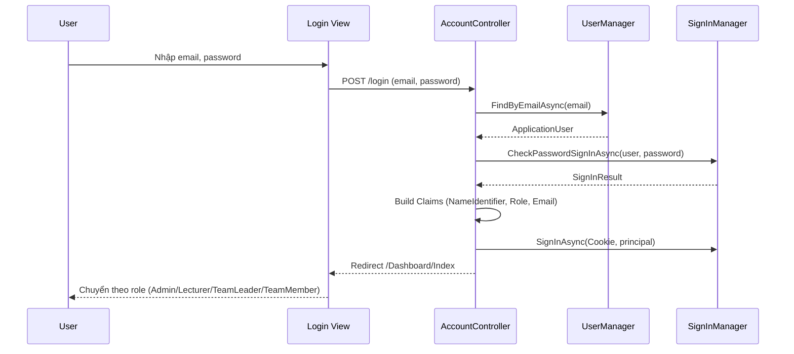

**Sequence Diagram 2 – Cập nhật trạng thái task (UC-08)**

Actor: Team Member. Luồng: Chọn trạng thái mới trên dropdown → PUT /api/tasks/{id}/status → TaskController.UpdateStatus → kiểm tra quyền (member chỉ sửa task của mình) → AppDbContext.SaveChanges → trả TaskResponse.


*Hình: Sequence Diagram – UC-08 Cập nhật trạng thái task.*

```mermaid
sequenceDiagram
    participant M as Team Member
    participant V as TeamMember View
    participant TC as TaskController
    participant DB as AppDbContext

    M->>V: Chọn trạng thái (Todo/Working/Done)
    V->>TC: PUT /api/tasks/{id}/status { status }
    TC->>DB: FirstOrDefaultAsync(task)
    DB-->>TC: TaskItem
    TC->>TC: Check: Member chỉ sửa task được giao cho mình
    alt AssigneeUserId != currentUser
        TC-->>V: 403 Forbid
    else OK
        TC->>DB: task.Status = req.Status; SaveChangesAsync()
        DB-->>TC: saved
        TC-->>V: 200 TaskResponse
    end
    V-->>M: Cập nhật badge & thống kê
```

**Sequence Diagram 3 – Đồng bộ Jira (UC-06)**

Actor: Team Leader. Objects: Browser → JiraController.Sync → JiraService.SyncProjectIssuesToTasksAsync → HttpClient gọi Jira Cloud REST API → map issues → AppDbContext (upsert TaskItem) → trả kết quả.


*Hình: Sequence Diagram – UC-06 Đồng bộ Jira.*

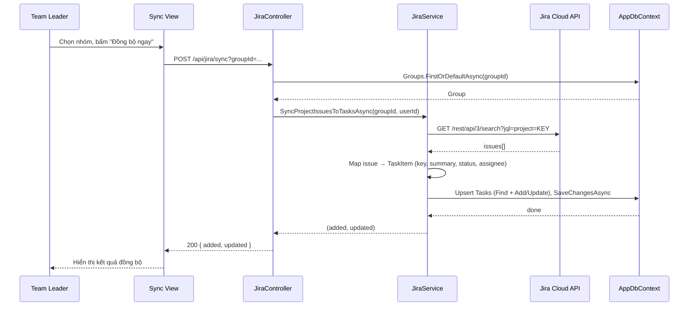

**Sequence Diagram 4 – Quản lý nhóm CRUD (UC-02)**

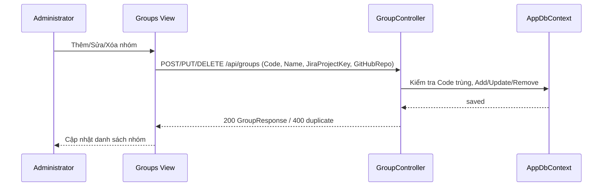

**Sequence Diagram 5 – Quản lý giảng viên (UC-03)**

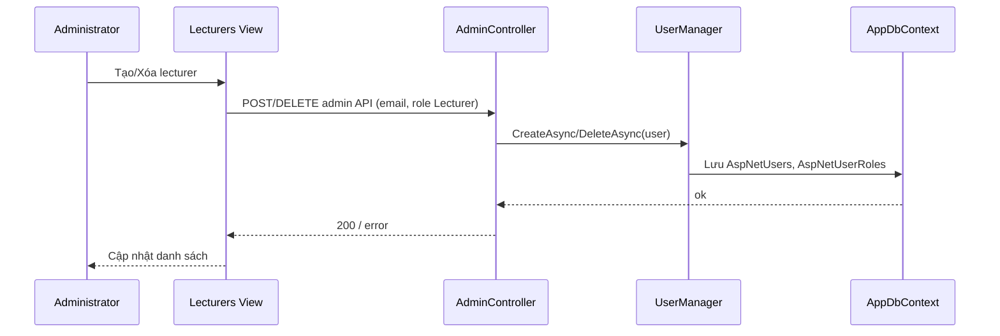

**Sequence Diagram 6 – Gán giảng viên vào nhóm (UC-04)**

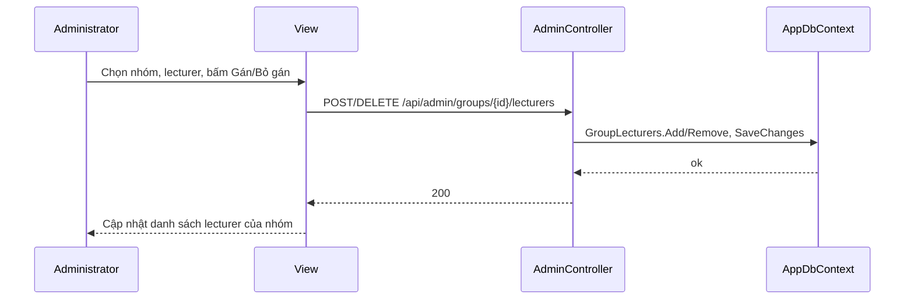

**Sequence Diagram 7 – Thêm/Xóa thành viên nhóm (UC-05)**

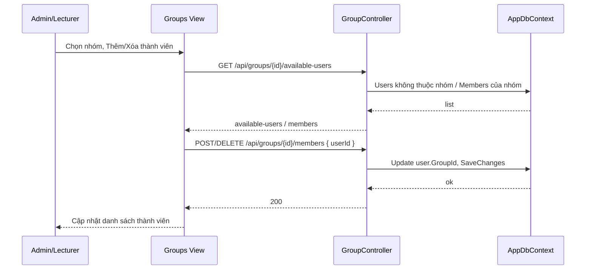

**Sequence Diagram 8 – Quản lý công việc / Phân công task (UC-07)**

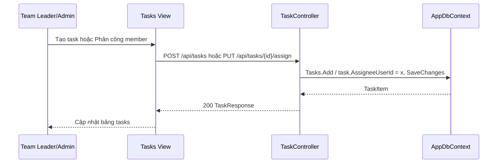

**Sequence Diagram 9 – Tạo SRS (UC-09)**

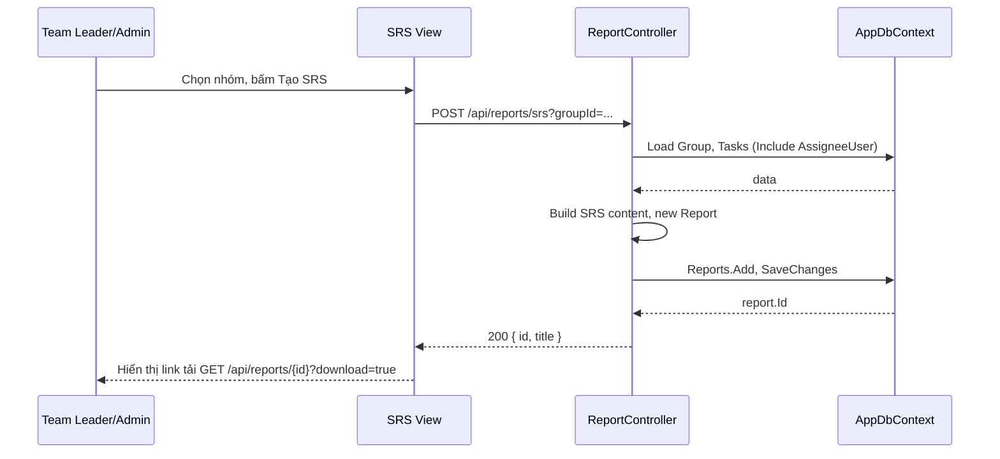

**Sequence Diagram 10 – Đồng bộ GitHub (UC-10)**

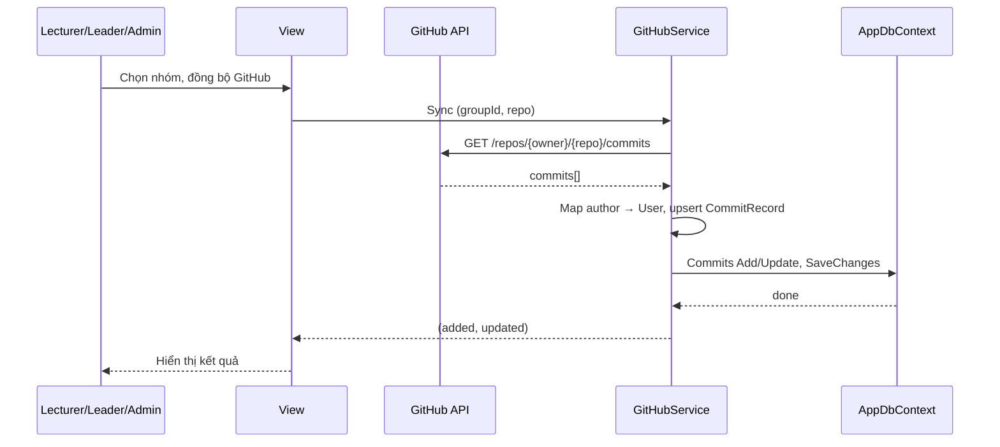

**Sequence Diagram 11 – Xem thống kê commit / báo cáo (UC-11)**

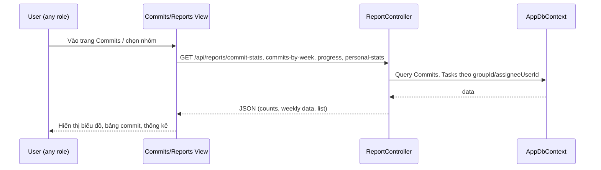

---

#### III.1.2 Communication Diagram

[Provide the Communication diagram(s) for the feature, see the sample below.]

Communication diagram nhấn mạnh **cấu trúc và quan hệ giữa các đối tượng** (structure and relationships between objects). Số thứ tự trên mũi tên thể hiện thứ tự gọi message. Dưới đây cung cấp **đủ 11 use case** – mỗi diagram gồm: View/Client, Controller (hoặc Service), AppDbContext (hoặc API ngoài), với các message đánh số 1, 2, 3...

**Bảng tóm tắt – Communication Diagram theo UC**

| UC | Use Case | Đối tượng chính trong diagram |
|----|----------|-------------------------------|
| UC-01 | Đăng nhập | Login View, AccountController, UserManager, SignInManager |
| UC-02 | Quản lý nhóm CRUD | Groups View, GroupController, AppDbContext |
| UC-03 | Quản lý giảng viên | View, AdminController, UserManager, AppDbContext |
| UC-04 | Gán lecturer vào nhóm | View, AdminController, AppDbContext |
| UC-05 | Thêm/Xóa thành viên nhóm | View, GroupController, AppDbContext |
| UC-06 | Đồng bộ Jira | Sync View, JiraController, JiraService, Jira API, AppDbContext |
| UC-07 | Quản lý công việc | Tasks View, TaskController, AppDbContext |
| UC-08 | Cập nhật trạng thái task | View, TaskController, AppDbContext |
| UC-09 | Tạo SRS | SRS View, ReportController, AppDbContext |
| UC-10 | Đồng bộ GitHub | View, GitHubService, GitHub API, AppDbContext |
| UC-11 | Xem thống kê commit / báo cáo | Commits View, ReportController, AppDbContext |

---

**Communication Diagram 1 – UC-01 Đăng nhập**

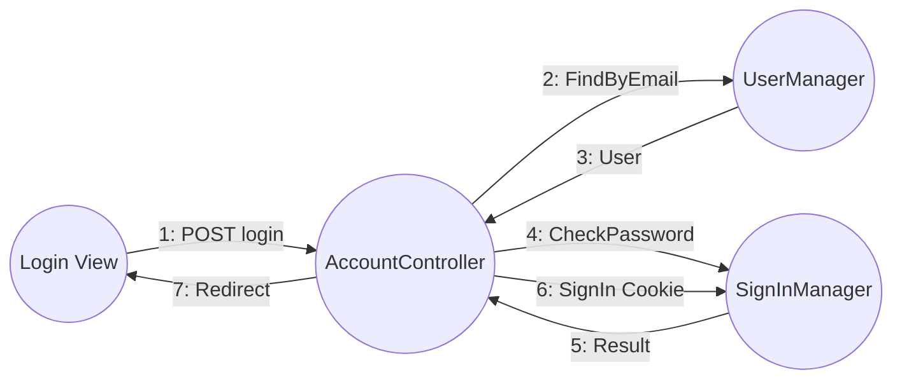

**Communication Diagram 2 – UC-02 Quản lý nhóm**

```mermaid
flowchart LR
    V((Groups View)) -->|1: POST/PUT/DELETE| GC((GroupController))
    GC -->|2: Validate Code| DB((AppDbContext))
    DB -->|3: ok| GC
    GC -->|4: Save| DB
    GC -->|5: Response| V
```

**Communication Diagram 3 – UC-03 Quản lý giảng viên**

```mermaid
flowchart LR
    V((View)) -->|1: Create/Delete| AC((AdminController))
    AC -->|2: UserManager| UM((UserManager))
    UM -->|3: DB| DB((AppDbContext))
    DB -->|4: ok| AC
    AC -->|5: Response| V
```

**Communication Diagram 4 – UC-04 Gán lecturer vào nhóm**

```mermaid
flowchart LR
    V((View)) -->|1: POST/DELETE lecturers| AC((AdminController))
    AC -->|2: GroupLecturers Add/Remove| DB((AppDbContext))
    DB -->|3: ok| AC
    AC -->|4: 200| V
```

**Communication Diagram 5 – UC-05 Thêm/Xóa thành viên nhóm**

```mermaid
flowchart LR
    V((View)) -->|1: GET available-users| GC((GroupController))
    GC -->|2: Query Users| DB((AppDbContext))
    DB -->|3: list| GC
    GC -->|4: POST/DELETE members| V
    V -->|5: members API| GC
    GC -->|6: Update GroupId| DB
    GC -->|7: 200| V
```

**Communication Diagram 6 – UC-06 Đồng bộ Jira**

```mermaid
flowchart LR
    V((Sync View)) -->|1: POST sync| J((JiraController))
    J -->|2: SyncAsync| S((JiraService))
    S -->|3: GET search| API((Jira API))
    API -->|4: issues| S
    S -->|5: Upsert| D((AppDbContext))
    D -->|6: done| S
    S -->|7: (added,updated)| J
    J -->|8: JSON| V
```

**Communication Diagram 7 – UC-07 Quản lý công việc**

```mermaid
flowchart LR
    V((Tasks View)) -->|1: POST task / PUT assign| TC((TaskController))
    TC -->|2: Load Group, Validate| DB((AppDbContext))
    DB -->|3: data| TC
    TC -->|4: Add/Update Task| DB
    TC -->|5: TaskResponse| V
```

**Communication Diagram 8 – UC-08 Cập nhật trạng thái task**

```mermaid
flowchart LR
    subgraph " :Team Member"
        A((View))
    end
    subgraph " :API"
        B((TaskController))
    end
    subgraph " :Data"
        C((AppDbContext))
    end

    A -->|"1: PUT status"| B
    B -->|"2: Load task"| C
    C -->|"3: TaskItem"| B
    B -->|"4: Update, Save"| C
    C -->|"5: ok"| B
    B -->|"6: TaskResponse"| A
```

**Communication Diagram 9 – UC-09 Tạo SRS**

```mermaid
flowchart LR
    V((SRS View)) -->|1: POST srs| RC((ReportController))
    RC -->|2: Load Group, Tasks| DB((AppDbContext))
    DB -->|3: data| RC
    RC -->|4: Build content, Add Report| DB
    DB -->|5: id| RC
    RC -->|6: { id, title }| V
    V -->|7: GET report download| RC
```

**Communication Diagram 10 – UC-10 Đồng bộ GitHub**

```mermaid
flowchart LR
    V((View)) -->|1: Sync| GS((GitHubService))
    GS -->|2: GET commits| API((GitHub API))
    API -->|3: commits[]| GS
    GS -->|4: Map, Upsert Commits| DB((AppDbContext))
    DB -->|5: ok| GS
    GS -->|6: result| V
```

**Communication Diagram 11 – UC-11 Xem thống kê commit / báo cáo**

```mermaid
flowchart LR
    V((Commits View)) -->|1: GET commit-stats, commits-by-week, progress| RC((ReportController))
    RC -->|2: Query Commits, Tasks| DB((AppDbContext))
    DB -->|3: data| RC
    RC -->|4: JSON| V
```

---

### III.2 State Diagram

State diagram cho entity **Task** (TaskItem): các trạng thái là Todo, InProgress, Done; chuyển tiếp khi Team Member / Team Leader / Admin cập nhật trạng thái qua API hoặc giao diện.


*Hình: State Diagram – Trạng thái Task (TaskItemStatus: Todo, InProgress, Done).*

**Mã Mermaid (dán vào mermaid.ai nếu cần xem/export lại):**

```mermaid
stateDiagram-v2
    [*] --> Todo: Tạo task mới
    Todo --> InProgress: Bắt đầu thực hiện (status = InProgress)
    InProgress --> Todo: Chuyển lại Todo (nếu cần)
    InProgress --> Done: Hoàn thành (status = Done)
    Done --> InProgress: Mở lại (nếu cần)
    Done --> [*]: (giữ Done)
```

*Hình: State Diagram – Trạng thái Task (TaskItemStatus: Todo, InProgress, Done).*

Trong code: `TaskItem.Status` kiểu `TaskItemStatus` (enum); cập nhật qua `PUT /api/tasks/{id}/status` với body `{ "status": 0|1|2 }`. Hệ thống cho phép chuyển qua lại giữa các trạng thái (không ràng buộc nghiệp vụ cứng).

---

## IV. Design Specification

### IV.1 Integrated Communication Diagrams

Sơ đồ communication tích hợp mô tả luồng tương tác chính giữa các thành phần hệ thống: người dùng (Browser), tầng Presentation (MVC + API Controllers), tầng Business (Services), tầng Data (DbContext, SQL Server), và hệ thống ngoài (Jira, GitHub).

```mermaid
flowchart TB
    subgraph Users
        U1((Admin))
        U2((Lecturer))
        U3((Team Leader))
        U4((Team Member))
    end

    subgraph Presentation
        MVC((MVC Views))
        API((API Controllers))
    end

    subgraph Business
        JiraSvc((JiraService))
        GitHubSvc((GitHubService))
        TokenSvc((TokenService))
    end

    subgraph Data
        Db((AppDbContext))
    end

    subgraph External
        JiraAPI((Jira Cloud))
        GitHubAPI((GitHub))
    end

    U1 & U2 & U3 & U4 --> MVC
    U1 & U2 & U3 & U4 --> API
    MVC --> API
    API --> JiraSvc
    API --> GitHubSvc
    API --> TokenSvc
    API --> Db
    JiraSvc --> JiraAPI
    GitHubSvc --> GitHubAPI
    JiraSvc --> Db
    GitHubSvc --> Db
```

*Hình: Integrated Communication Diagram – Tương tác giữa User, Presentation, Business, Data và External systems.*

### IV.2 System High-Level Design

Kiến trúc tổng thể SWP Tracker theo mô hình phân tầng (Layered): Presentation (MVC Views + API Controllers), Business (Services), Data (DbContext, Entities), Security (Identity, JWT, Cookie). Sơ đồ dưới minh họa các tầng và thành phần chính.

```mermaid
flowchart TB
    subgraph Presentation["Presentation Layer"]
        Views["MVC Views\n(Dashboard, Groups, Tasks, Sync, SRS, Commits)"]
        Controllers["API Controllers\n(Auth, Group, Task, Admin, Report, Jira, GitHub)"]
        Account["AccountController\n(Login/Logout Cookie)"]
    end

    subgraph Business["Business Layer"]
        JiraService["JiraService"]
        GitHubService["GitHubService"]
        TokenService["TokenService"]
    end

    subgraph Data["Data Layer"]
        DbContext["AppDbContext"]
        Entities["Entities\n(Group, TaskItem, CommitRecord, Report, ApplicationUser, GroupLecturer)"]
    end

    subgraph Security["Security"]
        Identity["ASP.NET Identity"]
        JWT["JWT Bearer"]
        Cookie["Cookie Auth"]
    end

    subgraph External["External"]
        Jira["Jira Cloud API"]
        GitHub["GitHub API"]
    end

    Views --> Controllers
    Account --> Identity
    Controllers --> Identity
    Controllers --> JWT
    Controllers --> Cookie
    Controllers --> JiraService
    Controllers --> GitHubService
    Controllers --> TokenService
    Controllers --> DbContext
    JiraService --> DbContext
    JiraService --> Jira
    GitHubService --> DbContext
    GitHubService --> GitHub
    DbContext --> Entities
```

*Hình: System High-Level Design – Các tầng và thành phần chính của SWP Tracker.*

### IV.3 Package / Component

| Package | Mô tả |
|---------|--------|
| Controllers | Dashboard, Account, Home (MVC); Auth, Group, Task, Admin, Report, Jira, GitHub (API). |
| Entities | Group, TaskItem, CommitRecord, Report, ApplicationUser, GroupLecturer. |
| Data | AppDbContext, SeedExtensions. |
| Services | JiraService, GitHubService, TokenService. |
| Dtos, Security | AuthDtos, GroupDtos, TaskDtos; Roles, Options. |
| Views/Dashboard | Groups, Tasks, Sync, SRS, Commits, Lecturers, ... |

### IV.4 Component and Package Diagram

#### IV.4.1 Package Diagram

Sơ đồ package thể hiện cấu trúc logic hệ thống SWP Tracker theo các gói chức năng và quan hệ <<Access>> / <<Import>> giữa các gói. (Có thể vẽ lại trong Word/draw.io theo mô tả dưới đây hoặc chèn ảnh mẫu.)

**Các package và thành phần bên trong:**

- **UserManagement:** Quản lý vai trò người dùng — Admin, TeamLeader, TeamMember, Lecturer (Event/giảng viên).
- **RequirementManagement:** Quản lý yêu cầu và công việc — Backlog & SRS, Task Management, Jira Sync.
- **ProgressTracking:** Theo dõi tiến độ — Task Status, GitHub commit & Comments, Commit Stats.
- **Integration (báo cáo/cộng tác):** Báo cáo tiến độ, theo dõi công bố, cộng tác (Progress Reports, Publication Tracking, Research Collaboration) — trong SWP Tracker tương ứng báo cáo SRS, Progress, Commits.
- **Integration (tích hợp ngoài):** Tích hợp Jira/GitHub — Jira API Adapter, Jira Projects API Adapter, Link Issues & Commits.
- **Configuration:** Cấu hình hệ thống — Courses & Groups Config Data, User & Groups GitHub Repos, Settings Reporting Data.

**Quan hệ:**

- **<<Access>>** (mũi tên nét đứt, đầu mở): UserManagement <<Access>> RequirementManagement; UserManagement <<Access>> Integration (báo cáo); Integration (báo cáo) <<Access>> Integration (Jira/GitHub); Integration (báo cáo) <<Access>> Configuration.
- **<<Import>>** (mũi tên nét đứt, đầu đóng): RequirementManagement <<Import>> ProgressTracking; Integration (Jira/GitHub) <<Import>> ProgressTracking; Integration (Jira/GitHub) <<Import>> Configuration.

**Package descriptions**

| No | Package | Description |
|----|---------|-------------|
| 01 | UserManagement | Quản lý các vai trò trong hệ thống: Admin, TeamLeader, TeamMember, Lecturer (giảng viên). Bao gồm đăng ký/đăng nhập, phân quyền theo role, gán user vào nhóm. |
| 02 | RequirementManagement | Quản lý yêu cầu dự án: backlog, tài liệu SRS, quản lý task và đồng bộ với Jira (Jira Sync). Tạo và cập nhật công việc theo nhóm. |
| 03 | ProgressTracking | Theo dõi tiến độ: trạng thái task (Todo/In Progress/Done), commit và bình luận từ GitHub, thống kê commit (commit stats) và liên kết stub. |
| 04 | Integration (Reports/Collaboration) | Báo cáo tiến độ (Progress Reports), theo dõi công bố (Publication Tracking), cộng tác nghiên cứu (Research Collaboration). Trong SWP Tracker: tạo SRS, báo cáo progress, danh sách commit theo nhóm. |
| 05 | Integration (External APIs) | Tích hợp hệ thống ngoài: Jira API Adapter, Jira Projects API Adapter, liên kết Issues & Commits. Gọi Jira Cloud REST API và GitHub REST API. |
| 06 | Configuration | Cấu hình dữ liệu: khóa học và nhóm (Courses & Groups Config Data), user/nhóm và GitHub repos (User & Groups GitHub Repos), cài đặt báo cáo (Settings Reporting Data). Trong code: appsettings, Group.JiraProjectKey, Group.GitHubRepo, SeedExtensions. |

### IV.5 Class Diagram

Class diagram dựa trên code web SWP Tracker (Entities, Services, DTOs). Dưới đây là hình tổng quan; phần Mermaid bên dưới thể hiện chi tiết thuộc tính và quan hệ.


*Hình: Class Diagram – Các lớp chính (ApplicationUser, Group, GroupLecturer, TaskItem, CommitRecord, Report).*

---

**Diagram 1 – Entities & Data (Entities, AppDbContext)** – Mermaid

```mermaid
classDiagram
  direction TB

  class IdentityUser~Guid~ {
    <<Identity>>
    +Guid Id
    +string UserName
    +string Email
    +string PasswordHash
  }

  class ApplicationUser {
    +Guid? GroupId
    +string GitHubUsername
    +Group? Group
  }

  class Group {
    +Guid Id
    +string Code
    +string Name
    +string JiraProjectKey
    +string GitHubRepo
    +List~ApplicationUser~ Users
  }

  class GroupLecturer {
    +Guid GroupId
    +Guid LecturerUserId
    +Group Group
    +ApplicationUser LecturerUser
  }

  class TaskItemStatus {
    <<enumeration>>
    Todo
    InProgress
    Done
  }

  class TaskItem {
    +Guid Id
    +string Title
    +string Description
    +TaskItemStatus Status
    +string JiraIssueKey
    +Guid AssigneeUserId
    +Guid? GroupId
    +DateTimeOffset CreatedAt
    +DateTimeOffset UpdatedAt
    +ApplicationUser AssigneeUser
    +Group Group
  }

  class CommitRecord {
    +Guid Id
    +string Sha
    +string Message
    +string AuthorName
    +string AuthorEmail
    +DateTimeOffset CommittedAt
    +Guid UserId
    +Guid? GroupId
    +ApplicationUser User
    +Group Group
  }

  class ReportType {
    <<enumeration>>
    Srs
    Progress
  }

  class Report {
    +Guid Id
    +ReportType Type
    +string Title
    +string Content
    +Guid GroupId
    +Guid CreatedByUserId
    +DateTimeOffset CreatedAt
    +Group Group
    +ApplicationUser CreatedByUser
  }

  class AppDbContext {
    +DbSet~Group~ Groups
    +DbSet~GroupLecturer~ GroupLecturers
    +DbSet~TaskItem~ Tasks
    +DbSet~CommitRecord~ Commits
    +DbSet~Report~ Reports
    +OnModelCreating(ModelBuilder)
  }

  IdentityUser~Guid~ <|-- ApplicationUser
  Group "1" o-- "*" ApplicationUser : Users
  Group "1" *-- "*" GroupLecturer : 
  ApplicationUser "1" *-- "*" GroupLecturer : LecturerUser
  TaskItemStatus --> TaskItem : Status
  Group "1" o-- "*" TaskItem : 
  ApplicationUser "1" o-- "*" TaskItem : AssigneeUser
  Group "1" o-- "*" CommitRecord : 
  ApplicationUser "1" o-- "*" CommitRecord : User
  ReportType --> Report : Type
  Group "1" o-- "*" Report : 
  ApplicationUser "1" o-- "*" Report : CreatedByUser
  AppDbContext --> Group : manages
  AppDbContext --> GroupLecturer : manages
  AppDbContext --> TaskItem : manages
  AppDbContext --> CommitRecord : manages
  AppDbContext --> Report : manages
```

**Diagram 2 – Services, Options & DTOs**

```mermaid
classDiagram
  direction TB

  class JiraOptions {
    +string BaseUrl
    +string Email
    +string ApiToken
    +string ProjectKey
  }

  class GitHubOptions {
    +string Owner
    +string Repo
    +string Token
  }

  class JwtOptions {
    +string Issuer
    +string Audience
    +string SigningKey
    +int ExpiresMinutes
  }

  class JiraService {
    -IHttpClientFactory _httpClientFactory
    -JiraOptions _options
    -AppDbContext _db
    +CreateClient(string) HttpClient
    +SyncProjectIssuesToTasksAsync(Guid, Guid, CancellationToken)
  }

  class GitHubService {
    -IHttpClientFactory _httpClientFactory
    -GitHubOptions _options
    -AppDbContext _db
    +CreateClient() HttpClient
    +SyncRepoCommitsAsync(Guid, int, CancellationToken)
  }

  class TokenService {
    +CreateAccessTokenAsync(ApplicationUser) string
  }

  class CreateGroupRequest {
    <<record>>
    +string Code
    +string Name
    +string JiraProjectKey
    +string GitHubRepo
  }

  class GroupResponse {
    <<record>>
    +Guid Id
    +string Code
    +string Name
    +string JiraProjectKey
    +string GitHubRepo
  }

  class CreateTaskRequest {
    <<record>>
    +string Title
    +string Description
    +Guid AssigneeUserId
    +Guid GroupId
  }

  class TaskResponse {
    <<record>>
    +Guid Id
    +string Title
    +TaskItemStatus Status
    +string JiraIssueKey
    +Guid AssigneeUserId
    +Guid GroupId
    +DateTimeOffset CreatedAt
    +DateTimeOffset UpdatedAt
  }

  class LoginRequest {
    <<record>>
    +string Email
    +string Password
  }

  class AuthResponse {
    <<record>>
    +string AccessToken
    +string Role
    +string Email
  }

  class UserResponse {
    <<record>>
    +Guid Id
    +string Email
    +string UserName
    +string Role
  }

  class AppDbContext {
    +DbSet~Group~ Groups
    +DbSet~TaskItem~ Tasks
    +DbSet~CommitRecord~ Commits
    +DbSet~Report~ Reports
  }

  JiraService --> AppDbContext : uses
  JiraService --> JiraOptions : uses
  GitHubService --> AppDbContext : uses
  GitHubService --> GitHubOptions : uses
```

**Quan hệ chính (theo code):**

| Quan hệ | Mô tả |
|---------|--------|
| ApplicationUser : IdentityUser&lt;Guid&gt; | Kế thừa (ASP.NET Identity); thêm GroupId, Group, GitHubUsername. |
| Group ↔ ApplicationUser | 1–N: một nhóm có nhiều user (Users); user thuộc một nhóm (GroupId). |
| Group ↔ GroupLecturer ↔ ApplicationUser | N–N Lecturer–Group qua bảng GroupLecturer (GroupId, LecturerUserId). |
| Group ↔ TaskItem | 1–N: một nhóm có nhiều task; TaskItem.GroupId, TaskItem.AssigneeUserId → User. |
| Group ↔ CommitRecord | 1–N: commit thuộc nhóm (GroupId); CommitRecord.UserId → User. |
| Group ↔ Report | 1–N: báo cáo theo nhóm; Report.CreatedByUserId → User. |
| AppDbContext | Quản lý DbSet cho Group, GroupLecturer, TaskItem, CommitRecord, Report và Identity. |
| JiraService, GitHubService | Phụ thuộc AppDbContext, Options (JiraOptions/GitHubOptions), IHttpClientFactory; Controller gọi Service. |

### IV.6 Database Design

Provide the tables relationship following **SQL database naming convention** (snake_case for tables and columns). Dự án triển khai bằng SQL Server + EF Core; các sơ đồ Logical/Physical dùng kiểu dữ liệu chuẩn SQL.

---

#### IV.6.1. Conceptual Diagram

Mức khái niệm: chỉ thực thể và quan hệ. Hệ thống gồm: **User**, **Group**, **GroupLecturer**, **Task**, **Commit**, **Report**, **Role**.


*Hình: IV.6.1 Conceptual Diagram – ERD ký hiệu Chen (chữ nhật = thực thể, thoi = quan hệ).*

```mermaid
erDiagram
  user ||--o{ group : "belongs to"
  user ||--o{ task : "assigned"
  user ||--o{ commit : "author"
  user ||--o{ report : "created_by"
  group ||--o{ task : "has"
  group ||--o{ commit : "has"
  group ||--o{ report : "has"
  group ||--o{ group_lecturer : ""
  user ||--o{ group_lecturer : "lecturer"
  role ||--o{ user_role : ""
  user ||--o{ user_role : ""

  user {
    guid id PK
    string email
    string user_name
    guid group_id FK
  }

  group {
    guid id PK
    string code UK
    string name
    string jira_project_key
    string github_repo
  }

  group_lecturer {
    guid group_id PK,FK
    guid lecturer_user_id PK,FK
  }

  task {
    guid id PK
    string title
    int status
    guid assignee_user_id FK
    guid group_id FK
  }

  commit {
    guid id PK
    string sha
    guid user_id FK
    guid group_id FK
  }

  report {
    guid id PK
    int type
    string title
    guid group_id FK
    guid created_by_user_id FK
  }

  role {
    guid id PK
    string name
  }
```

**Tóm tắt quan hệ (Conceptual):**

| Thực thể 1 | Quan hệ | Thực thể 2 | Mô tả |
|------------|---------|------------|--------|
| User | N : 1 | Group | User thuộc một nhóm (group_id). |
| Group | 1 : N | Task | Một nhóm có nhiều task. |
| Group | 1 : N | Commit | Một nhóm có nhiều commit. |
| Group | 1 : N | Report | Một nhóm có nhiều báo cáo. |
| Group, User | N : N | GroupLecturer | Nhiều giảng viên – nhiều nhóm (bảng trung gian). |
| User | 1 : N | Task | User được gán nhiều task (assignee). |
| User | 1 : N | Commit | User là tác giả nhiều commit. |
| User | 1 : N | Report | User tạo nhiều báo cáo. |
| User, Role | N : N | (AspNetUserRoles) | User có nhiều role. |

---

#### IV.6.2. Logical Diagram

Mức logic: tên bảng và cột theo quy ước SQL (snake_case), kiểu dữ liệu chuẩn SQL.


*Hình: IV.6.2 Logical Diagram – Sơ đồ quan hệ bảng (diagram, snake_case).*

**Bảng ứng dụng (application tables):**

| Bảng | Cột | Kiểu (MySQL) | Ràng buộc |
|------|-----|----------------|-----------|
| **groups** | id | CHAR(36) | PK |
| | code | VARCHAR(32) | NOT NULL, UNIQUE |
| | name | VARCHAR(256) | NOT NULL |
| | jira_project_key | VARCHAR(128) | NULL |
| | github_repo | VARCHAR(256) | NULL |
| **group_lecturers** | group_id | CHAR(36) | PK, FK → groups(id) |
| | lecturer_user_id | CHAR(36) | PK, FK → aspnet_users(id) |
| **tasks** | id | CHAR(36) | PK |
| | title | VARCHAR(256) | NOT NULL |
| | description | TEXT | NULL |
| | status | INT | NOT NULL (0=Todo, 1=InProgress, 2=Done) |
| | jira_issue_key | VARCHAR(32) | NULL, INDEX |
| | assignee_user_id | CHAR(36) | NOT NULL, FK → aspnet_users(id) |
| | group_id | CHAR(36) | NULL, FK → groups(id) |
| | created_at | DATETIME(6) | NOT NULL |
| | updated_at | DATETIME(6) | NOT NULL |
| **commits** | id | CHAR(36) | PK |
| | sha | VARCHAR(64) | NOT NULL |
| | message | TEXT | NOT NULL |
| | author_name | VARCHAR(256) | NOT NULL |
| | author_email | VARCHAR(256) | NULL |
| | committed_at | DATETIME(6) | NOT NULL |
| | user_id | CHAR(36) | NOT NULL, FK → aspnet_users(id) |
| | group_id | CHAR(36) | NULL, FK → groups(id) |
| | UNIQUE (group_id, sha) | | Khi group_id IS NOT NULL |
| | UNIQUE (sha) | | Khi group_id IS NULL (filtered) |
| **reports** | id | CHAR(36) | PK |
| | type | INT | NOT NULL (0=Srs, 1=Progress) |
| | title | VARCHAR(256) | NOT NULL |
| | content | LONGTEXT | NOT NULL |
| | group_id | CHAR(36) | NOT NULL, FK → groups(id) |
| | created_by_user_id | CHAR(36) | NOT NULL, FK → aspnet_users(id) |
| | created_at | DATETIME(6) | NOT NULL |

**Bảng Identity (ASP.NET Identity – tên logic snake_case):**

| Bảng | Cột chính | Ghi chú |
|------|-----------|---------|
| **aspnet_users** | id (PK), user_name, normalized_user_name, email, normalized_email, password_hash, email_confirmed, security_stamp, concurrency_stamp, phone_number, phone_number_confirmed, two_factor_enabled, lockout_end, lockout_enabled, access_failed_count, **group_id** (FK → groups), **github_username** | Bảng user mở rộng. |
| **aspnet_roles** | id (PK), name, normalized_name, concurrency_stamp | Vai trò (Admin, Lecturer, TeamLeader, TeamMember). |
| **aspnet_user_roles** | user_id (PK,FK), role_id (PK,FK) | User – Role N:N. |
| **aspnet_user_claims** | id (PK), user_id (FK), claim_type, claim_value | |
| **aspnet_user_logins** | login_provider, provider_key (PK), provider_display_name, user_id (FK) | |
| **aspnet_user_tokens** | user_id, login_provider, name (PK), value | |
| **aspnet_role_claims** | id (PK), role_id (FK), claim_type, claim_value | |

**Sơ đồ Logical (quan hệ bảng – tên snake_case):**

```mermaid
erDiagram
  aspnet_users ||--o{ groups : "group_id"
  aspnet_users ||--o{ group_lecturers : "lecturer_user_id"
  aspnet_users ||--o{ tasks : "assignee_user_id"
  aspnet_users ||--o{ commits : "user_id"
  aspnet_users ||--o{ reports : "created_by_user_id"
  groups ||--o{ group_lecturers : "group_id"
  groups ||--o{ tasks : "group_id"
  groups ||--o{ commits : "group_id"
  groups ||--o{ reports : "group_id"
  aspnet_roles ||--o{ aspnet_user_roles : "role_id"
  aspnet_users ||--o{ aspnet_user_roles : "user_id"

  aspnet_users {
    char36 id PK
    varchar user_name
    varchar email
    char36 group_id FK
    varchar github_username
  }

  groups {
    char36 id PK
    varchar32 code UK
    varchar256 name
  }

  group_lecturers {
    char36 group_id PK,FK
    char36 lecturer_user_id PK,FK
  }

  tasks {
    char36 id PK
    varchar256 title
    int status
    char36 assignee_user_id FK
    char36 group_id FK
  }

  commits {
    char36 id PK
    varchar64 sha
    char36 user_id FK
    char36 group_id FK
  }

  reports {
    char36 id PK
    int type
    varchar256 title
    char36 group_id FK
    char36 created_by_user_id FK
  }
```

---

#### IV.6.3. Physical Diagram

Mức vật lý: triển khai thực tế. Dự án dùng **SQL Server** (EF Core). Bảng và cột trong DB dùng PascalCase (Groups, Tasks, AspNetUsers, …); kiểu dữ liệu SQL Server (uniqueidentifier, nvarchar, datetimeoffset).


*Hình: IV.6.3 Physical Diagram – Sơ đồ triển khai SQL Server (diagram, PascalCase).*

Dưới đây: DDL mẫu (SQL) snake_case và ánh xạ sang triển khai SQL Server.

**MySQL (snake_case) – script tham khảo:**

```sql
-- Groups
CREATE TABLE groups (
  id CHAR(36) NOT NULL PRIMARY KEY,
  code VARCHAR(32) NOT NULL UNIQUE,
  name VARCHAR(256) NOT NULL,
  jira_project_key VARCHAR(128) NULL,
  github_repo VARCHAR(256) NULL
);

-- Group Lecturers (N:N)
CREATE TABLE group_lecturers (
  group_id CHAR(36) NOT NULL,
  lecturer_user_id CHAR(36) NOT NULL,
  PRIMARY KEY (group_id, lecturer_user_id),
  FOREIGN KEY (group_id) REFERENCES groups(id) ON DELETE CASCADE,
  FOREIGN KEY (lecturer_user_id) REFERENCES aspnet_users(id) ON DELETE CASCADE
);

-- Tasks
CREATE TABLE tasks (
  id CHAR(36) NOT NULL PRIMARY KEY,
  title VARCHAR(256) NOT NULL,
  description TEXT NULL,
  status INT NOT NULL DEFAULT 0,
  jira_issue_key VARCHAR(32) NULL,
  assignee_user_id CHAR(36) NOT NULL,
  group_id CHAR(36) NULL,
  created_at DATETIME(6) NOT NULL,
  updated_at DATETIME(6) NOT NULL,
  FOREIGN KEY (assignee_user_id) REFERENCES aspnet_users(id) ON DELETE RESTRICT,
  FOREIGN KEY (group_id) REFERENCES groups(id) ON DELETE SET NULL,
  INDEX idx_tasks_group_id (group_id),
  INDEX idx_tasks_jira_issue_key (jira_issue_key)
);

-- Commits
CREATE TABLE commits (
  id CHAR(36) NOT NULL PRIMARY KEY,
  sha VARCHAR(64) NOT NULL,
  message TEXT NOT NULL,
  author_name VARCHAR(256) NOT NULL,
  author_email VARCHAR(256) NULL,
  committed_at DATETIME(6) NOT NULL,
  user_id CHAR(36) NOT NULL,
  group_id CHAR(36) NULL,
  FOREIGN KEY (user_id) REFERENCES aspnet_users(id) ON DELETE CASCADE,
  FOREIGN KEY (group_id) REFERENCES groups(id) ON DELETE SET NULL,
  UNIQUE KEY uq_commits_group_sha (group_id, sha),
  INDEX idx_commits_user_id (user_id),
  INDEX idx_commits_group_id (group_id)
);

-- Reports
CREATE TABLE reports (
  id CHAR(36) NOT NULL PRIMARY KEY,
  type INT NOT NULL,
  title VARCHAR(256) NOT NULL,
  content LONGTEXT NOT NULL,
  group_id CHAR(36) NOT NULL,
  created_by_user_id CHAR(36) NOT NULL,
  created_at DATETIME(6) NOT NULL,
  FOREIGN KEY (group_id) REFERENCES groups(id) ON DELETE CASCADE,
  FOREIGN KEY (created_by_user_id) REFERENCES aspnet_users(id) ON DELETE RESTRICT,
  INDEX idx_reports_group_id (group_id)
);

-- AspNetUsers phải có cột: group_id (CHAR(36) NULL FK → groups), github_username (VARCHAR(256) NULL)
-- AspNetRoles, AspNetUserRoles, AspNetUserClaims, AspNetUserLogins, AspNetUserTokens, AspNetRoleClaims
-- theo chuẩn ASP.NET Identity (tên bảng tương ứng).
```

**SQL Server (triển khai hiện tại – EF Core):**

- **Bảng:** AspNetUsers, AspNetRoles, AspNetUserRoles, AspNetUserClaims, AspNetUserLogins, AspNetUserTokens, AspNetRoleClaims, **Groups**, **GroupLecturers**, **Tasks**, **Commits**, **Reports**.
- **Kiểu:** uniqueidentifier (Guid), nvarchar(max/256/32), int, datetimeoffset, bit.
- **Chỉ số:** Groups(Code) UNIQUE; Commits(GroupId, Sha) UNIQUE filtered; Commits(Sha) UNIQUE filtered; Tasks(JiraIssueKey) index; FK theo OnDelete (SetNull, Cascade, Restrict) như trong snapshot.

**Ánh xạ Logical → Physical:**

| Logical (MySQL snake_case) | Physical (SQL Server – EF) |
|----------------------------|----------------------------|
| groups | Groups |
| group_lecturers | GroupLecturers |
| tasks | Tasks |
| commits | Commits |
| reports | Reports |
| aspnet_users | AspNetUsers |
| CHAR(36) | uniqueidentifier |
| DATETIME(6) | datetimeoffset |
| VARCHAR(n) | nvarchar(n) |
| TEXT/LONGTEXT | nvarchar(max) |

---

## V. Implementation

### V.1 Map Architecture to Project

- Presentation: Controllers (MVC + API), Views, wwwroot.
- Business: Services/.
- Data: Data/, Entities/.
- DTOs & Security: Dtos/, Security/.

### V.2 Map Class & Interaction to Code

Entity classes trong Entities/; AppDbContext cấu hình DbSet và quan hệ. JiraController.Sync → JiraService.SyncProjectIssuesToTasksAsync; ReportController GenerateSrs load Group, Tasks với Include(AssigneeUser), build content, lưu Report.

---

## VI. Alternative Architecture

### VI.1 SOA

Tách Jira Sync Service, GitHub Sync Service thành service riêng; Web gọi qua HTTP. Deployment diagram: Web, Jira Sync Service, GitHub Sync Service, DB. Cải thiện reusability, scalability.

### VI.2 Service Discovery

Dùng Consul/Eureka; các service đăng ký; client discovery để gọi. Deployment: Registry + nhiều instance Sync Service.

---

## Appendix: Business Rules

Các business rules áp dụng cho hệ thống SWP Tracker (theo use case và chức năng).

| ID | Business Rule | Business Rule Description |
|----|----------------|----------------------------|
| BR1 | Password Hashing | Mật khẩu người dùng phải được mã hóa (hash) bởi hệ thống; không lưu plain text. Hệ thống dùng ASP.NET Identity (PBKDF2) để băm mật khẩu khi đăng ký/đăng nhập. |
| BR2 | Unique Group Code | Mã nhóm (Code) phải duy nhất trong toàn hệ thống. Không cho phép tạo hoặc sửa nhóm trùng Code với nhóm đã tồn tại. |
| BR3 | Assignee in Group | Khi phân công người thực hiện task (assignee), người đó phải là thành viên của nhóm (user có GroupId trùng với GroupId của task). Chỉ được chọn từ danh sách member của nhóm. |
| BR4 | Task Status Update by Member | Team Member chỉ được cập nhật trạng thái (Todo / In Progress / Done) của task khi task đó được giao cho chính mình (AssigneeUserId = current user). Team Leader và Admin được cập nhật mọi task trong phạm vi quyền. |
| BR5 | Lecturer–Group Assignment | Chỉ Administrator được gán hoặc bỏ gán giảng viên (Lecturer) vào nhóm (bảng GroupLecturer). Lecturer chỉ được thêm/xóa thành viên trong các nhóm mà mình được gán. |
| BR6 | One Group per User | Mỗi user (sinh viên/thành viên) chỉ thuộc tối đa một nhóm tại một thời điểm (ApplicationUser.GroupId). Khi thêm user vào nhóm mới, hệ thống cập nhật GroupId của user. |
| BR7 | Jira Sync Project Key | Đồng bộ Jira chỉ thực hiện được khi nhóm đã cấu hình JiraProjectKey. Hệ thống chỉ lấy issues thuộc project có key tương ứng JiraProjectKey của nhóm. |
| BR8 | Commit Uniqueness | Mỗi commit (Sha) trong một nhóm chỉ lưu một bản ghi: (GroupId, Sha) là unique khi GroupId NOT NULL. Tránh trùng lặp khi đồng bộ GitHub nhiều lần. |
| BR9 | Email as Login | Đăng nhập sử dụng email làm định danh (username). Email phải unique trong hệ thống (RequireUniqueEmail). |
| BR10 | Role-Based Redirect | Sau khi đăng nhập thành công, hệ thống chuyển hướng (redirect) theo role: Admin → Admin dashboard, Lecturer → Lecturer, Team Leader → TeamLeader, Team Member → TeamMember. |

---

## Chuyển sang DOCX

- **Cách 1:** Mở file `SRS-SWP-Tracker.md` bằng Microsoft Word → **Lưu thành** → chọn **Word (.docx)**.
- **Cách 2:** Dùng Pandoc: `pandoc docs/SRS-SWP-Tracker.md -o docs/SRS-SWP-Tracker.docx`

Sau đó chỉnh font, heading và chèn hình (Context Diagram, ERD, Sequence, …) trong Word theo mẫu SRS.
