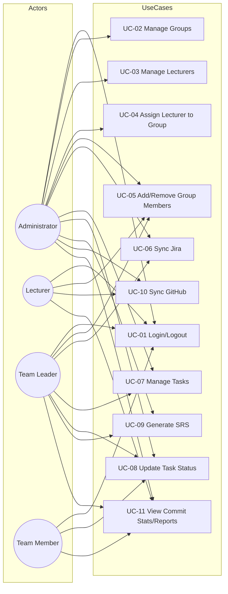
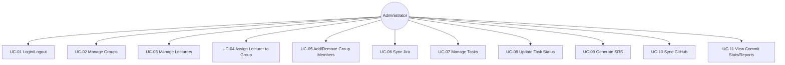
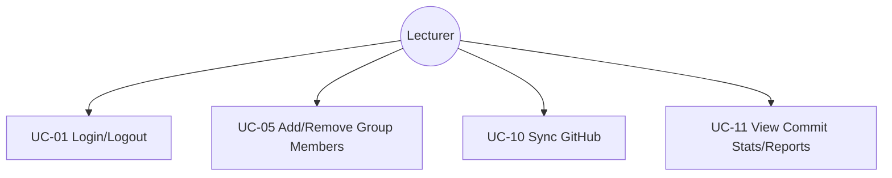
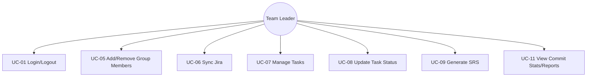
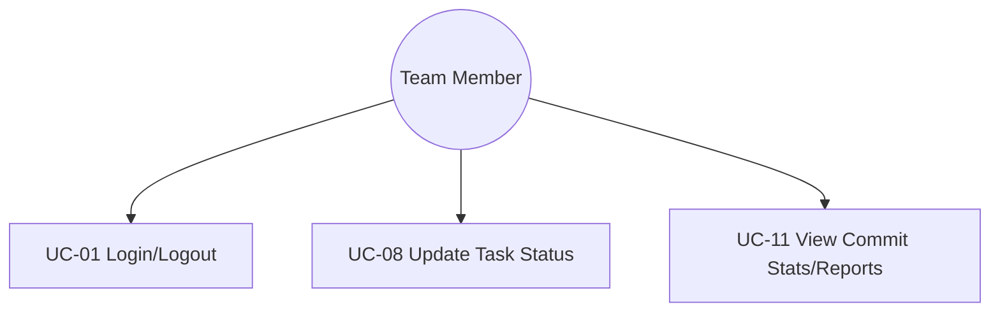
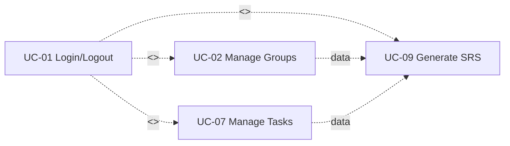
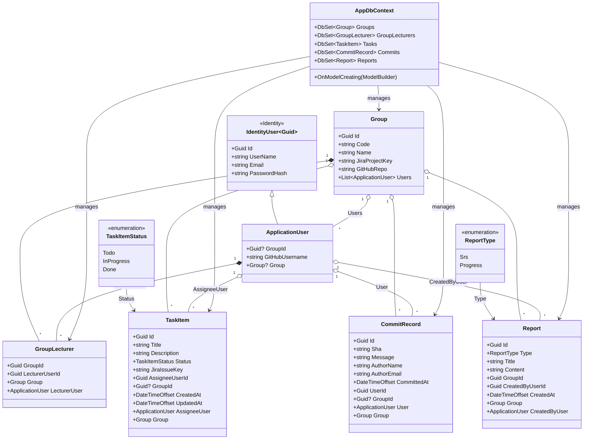
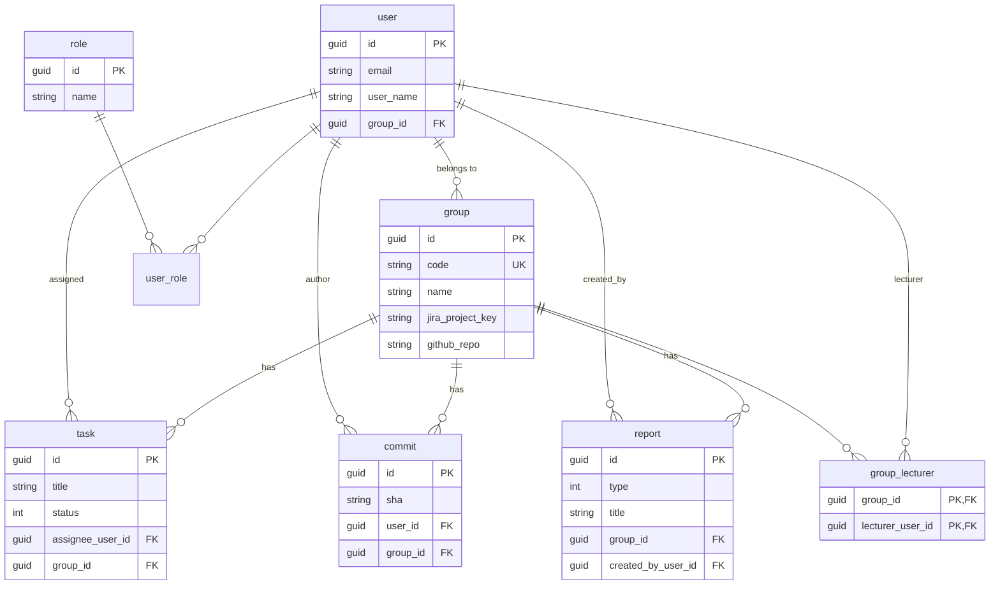
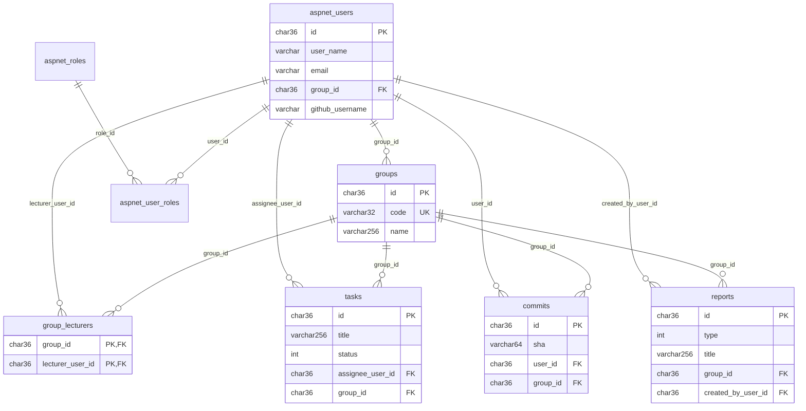

# Software Requirements Specification (SRS)
## Supporting Tool for Requirements and Project Progress Management in SWP391 Using Jira and GitHub (SWP Tracker)

**Version:** 1.0  
**Date:** 2026-03

---

## II. Product Overview

### II.1 Problem Description

**SWP Tracker** là phần mềm hỗ trợ quản lý yêu cầu và tiến độ dự án phần mềm cho môn học SWP391. Hệ thống thay thế quy trình thủ công trong việc tổng hợp yêu cầu từ Jira, theo dõi công việc (tasks), đồng bộ commit từ GitHub, và tạo tài liệu SRS/báo cáo tiến độ cho giảng viên.

Bối cảnh: Trong đào tạo ngành Kỹ thuật Phần mềm, Jira thường dùng để quản lý yêu cầu và công việc, GitHub dùng để quản lý mã nguồn. Sinh viên gặp khó khăn khi: (1) Tạo tài liệu SRS có hệ thống từ yêu cầu trên Jira; (2) Tổng hợp báo cáo phân công và thực hiện công việc theo nhóm; (3) Tổng hợp báo cáo commit trên GitHub để phản ánh đóng góp cá nhân. SWP Tracker kết nối với Jira Cloud REST API và GitHub REST API, lưu trữ dữ liệu nội bộ (nhóm, task, commit, báo cáo) và cung cấp giao diện theo vai trò (Admin, Lecturer, Team Leader, Team Member).

**Context Diagram (mô tả):** Hệ thống SWP Tracker nằm ở trung tâm, có luồng dữ liệu với: **Administrator**, **Lecturer**, **Team Leader**, **Team Member**, **Jira Cloud**, **GitHub**. (Vẽ hình: hộp trung tâm "SWP Tracker", xung quanh các terminators với mũi tên dữ liệu vào/ra.)

---

### II.2 Major Features

| ID | Feature | Mô tả |
|----|---------|--------|
| FE-01 | Quản lý nhóm (Groups) | CRUD nhóm; cấu hình Jira Project Key, GitHub Repo; gán thành viên. |
| FE-02 | Quản lý giảng viên | Admin tạo/xóa lecturer; gán lecturer vào nhóm (GroupLecturer). |
| FE-03 | Đồng bộ Jira | Team Leader/Admin đồng bộ issues từ Jira vào bảng Tasks. |
| FE-04 | Quản lý công việc (Tasks) | Tạo task, gán người, cập nhật trạng thái (Todo/In Progress/Done). |
| FE-05 | Tạo SRS | Tạo tài liệu SRS từ Groups, Tasks, Users; tải xuống .txt. |
| FE-06 | Đồng bộ GitHub | Đồng bộ commits từ repo vào bảng Commits. |
| FE-07 | Thống kê commit & báo cáo | commit-stats, commits-by-week, progress, personal-stats. |
| FE-08 | Xác thực & phân quyền | Login (Cookie/JWT), 4 role: Admin, Lecturer, TeamLeader, TeamMember. |

---

### II.3 Context Diagram

Hệ thống **SWP Tracker** ở trung tâm; các thực thể ngoài: Administrator, Lecturer, Team Leader, Team Member, Jira Cloud, GitHub. Luồng dữ liệu: Jira → Issues vào hệ thống; GitHub → Commits vào hệ thống; User ↔ Đăng nhập, CRUD, Sync, Tạo SRS.


*Hình: Context Diagram – SWP Tracker và các external entities.*

---

### II.4 Nonfunctional Requirements

| # | Feature | System Function | Description |
|---|---------|-----------------|-------------|
| 1 | Authentication | Cookie Authentication | Login MVC, session cookie cho Dashboard. |
| 2 | Authentication | JWT Bearer | API dùng JWT cho SPA/client. |
| 3 | Authorization | RBAC | 4 role; [Authorize(Roles = "...")] trên API và trang. |
| 4 | Integration | Jira Cloud REST API | GET /rest/api/3/search; sync issues → Tasks. |
| 5 | Integration | GitHub REST API | GET /repos/.../commits; sync → CommitRecord. |
| 6 | Data | EF Core + SQL Server | DbContext: Groups, GroupLecturers, Tasks, Commits, Reports, Identity. |
| 7 | Data | Seed | SeedExtensions: roles, users, groups, tasks, commits, reports. |

---

### II.5 Functional Requirements

#### II.5.1 Actors

| # | Actor | Description |
|---|-------|-------------|
| 1 | Administrator | Quản lý nhóm, giảng viên, gán GV–nhóm, Sync Jira/GitHub, Tạo SRS, xem Commits. |
| 2 | Lecturer | Xem nhóm được gán, thêm/xóa thành viên nhóm, xem requirements/tasks, báo cáo, thống kê commit, sync GitHub. |
| 3 | Team Leader | Xem nhóm mình, quản lý tasks, đồng bộ Jira, tạo SRS, xem commit. |
| 4 | Team Member | Xem/cập nhật task được giao, xem commit cá nhân. |

#### II.5.2 Use Cases

| ID | Use Case | Actors |
|----|----------|--------|
| UC-01 | Đăng nhập / Đăng xuất | All |
| UC-02 | Quản lý nhóm (CRUD) | Administrator |
| UC-03 | Quản lý giảng viên | Administrator |
| UC-04 | Gán giảng viên vào nhóm | Administrator |
| UC-05 | Thêm/Xóa thành viên nhóm | Administrator, Lecturer |
| UC-06 | Đồng bộ Jira | Team Leader, Administrator |
| UC-07 | Quản lý công việc (tạo task, xem) | Team Leader, Administrator |
| UC-08 | Cập nhật trạng thái task | Team Member, Team Leader, Administrator |
| UC-09 | Tạo SRS | Team Leader, Administrator |
| UC-10 | Đồng bộ GitHub commits | Lecturer, Team Leader, Administrator |
| UC-11 | Xem thống kê commit / báo cáo | Lecturer, Team Leader, Administrator, Team Member |

#### II.5.2.1 Diagram(s)

**Sơ đồ Use Case (hình vẽ)**


*Hình: Use Case Diagram – Actors và Use Cases.*

---

Các sơ đồ Use Case dưới đây (Mermaid) thể hiện chi tiết quan hệ giữa Actor và Use Case (ai thực hiện use case nào) và quan hệ giữa các Use Case (include/extend). Có thể vẽ lại trong Word, draw.io hoặc công cụ UML; dưới đây dùng Mermaid để minh họa (có thể render tại [Mermaid Live](https://mermaid.live) hoặc VS Code với extension Mermaid).

**Diagram 1 – Tổng quan Actor – Use Case (hệ thống SWP Tracker)**

Mỗi actor (Administrator, Lecturer, Team Leader, Team Member) được nối với các use case mà actor đó thực hiện.



**Diagram 2 – Phân theo từng Actor (4 sơ đồ con)**

*Administrator – các use case*



*Lecturer – các use case*



*Team Leader – các use case*



*Team Member – các use case*



**Diagram 3 – Quan hệ UC–UC (include)**

Use case **UC-01 Đăng nhập** được coi là <<include>> bởi các use case khác (trước khi thực hiện bất kỳ UC nào trong hệ thống, user phải đăng nhập). **UC-09 Tạo SRS** sử dụng dữ liệu từ nhóm và công việc (có thể xem như phụ thuộc vào thông tin từ UC-02/UC-07 trong ngữ cảnh dữ liệu).



**Ghi chú khi vẽ lại trong Word/draw.io:**

- **Actor:** vẽ hình “stick figure” (người que) hoặc hộp với tên; đặt bên trái hoặc bên phải hệ thống.
- **Use case:** vẽ hình oval (elip), bên trong ghi tên use case (động từ + tên đối tượng).
- **Hệ thống:** có thể vẽ một hình chữ nhật bao quanh các use case (boundary).
- **Quan hệ Association:** đường thẳng nối Actor với Use case mà actor đó thực hiện.
- **<<include>>:** mũi tên nét đứt từ use case A sang use case B, ghi «include» — A luôn gọi B.
- **<<extend>>:** (nếu có) mũi tên nét đứt từ use case mở rộng sang use case gốc, ghi «extend» — điều kiện mở rộng.

**Mô tả mẫu – UC-06 Đồng bộ Jira:** User chọn nhóm → bấm Đồng bộ → POST /api/jira/sync?groupId=... → JiraService gọi Jira API, map issues → TaskItem, lưu DB → trả về added, updated.

**Mô tả mẫu – UC-09 Tạo SRS:** User chọn nhóm → bấm Tạo SRS → POST /api/reports/srs?groupId=... → load Group, Tasks (Include AssigneeUser), tạo nội dung SRS, lưu Report → trả về Id, link tải.

#### II.5.3 Activity Diagram

Vẽ trong Word/draw.io cho một use case (ví dụ UC-06): Start → Chọn nhóm → Đồng bộ → Gọi API → [Thành công?] → Cập nhật DB → Hiển thị kết quả → End; nhánh lỗi → Hiển thị lỗi → End.

---

### II.6 Entity Relationship Diagram

Sơ đồ quan hệ thực thể (ERD) theo **ký hiệu Chen**: hình chữ nhật = thực thể, hình thoi = quan hệ, cardinality 1 / M trên các cạnh. User ở trung tâm, nối với Group, Task, Commit, Report và quan hệ N:N (giảng viên–nhóm).


*Hình: Entity Relationship Diagram – Ký hiệu Chen (thực thể = chữ nhật, quan hệ = thoi, 1/M).*

**Các bảng và quan hệ:**

- **AspNetUsers** (ApplicationUser): Id (PK), GroupId (FK → Groups), GitHubUsername.
- **Groups**: Id (PK), Code (unique), Name, JiraProjectKey, GitHubRepo.
- **GroupLecturers**: (GroupId, LecturerUserId) PK; FK → Groups, AspNetUsers.
- **Tasks**: Id (PK), Title, Description, Status, JiraIssueKey, AssigneeUserId (FK), GroupId (FK), CreatedAt, UpdatedAt.
- **Commits**: Id (PK), Sha, Message, AuthorName, AuthorEmail, CommittedAt, UserId (FK), GroupId (FK).
- **Reports**: Id (PK), Type, Title, Content, GroupId (FK), CreatedByUserId (FK), CreatedAt.

Quan hệ: Group 1–N Users; Group N–N Lecturers qua GroupLecturer; Group 1–N Tasks, Commits, Reports. User 1–N Tasks (assignee), 1–N Commits.

Vẽ ERD trong Word/draw.io theo các thực thể và quan hệ trên.

---

## III. Analysis Models

### III.1 Sequence Diagram (ví dụ UC-06)

Actor: Team Leader. Objects: Browser → JiraController → JiraService → AppDbContext, JiraService → Jira API. Luồng: Chọn nhóm, POST sync → Controller → Service gọi Jira API → map → SaveChanges → trả kết quả.

### III.2 State Diagram – Task

States: Todo, InProgress, Done. Transitions: Todo → InProgress → Done (và ngược lại nếu cho phép).

---

## IV. Design Specification

### IV.1 High-Level Design

Layered: Presentation (MVC Views + API Controllers), Business (JiraService, GitHubService, TokenService), Data (AppDbContext, Entities), Security (Identity, JWT, Cookie).

### IV.2 Package / Component

| Package | Mô tả |
|---------|--------|
| Controllers | Dashboard, Account, Home (MVC); Auth, Group, Task, Admin, Report, Jira, GitHub (API). |
| Entities | Group, TaskItem, CommitRecord, Report, ApplicationUser, GroupLecturer. |
| Data | AppDbContext, SeedExtensions. |
| Services | JiraService, GitHubService, TokenService. |
| Dtos, Security | AuthDtos, GroupDtos, TaskDtos; Roles, Options. |
| Views/Dashboard | Groups, Tasks, Sync, SRS, Commits, Lecturers, ... |

### IV.3 Component and Package Diagram

#### IV.3.1 Package Diagram

Sơ đồ package thể hiện cấu trúc logic hệ thống SWP Tracker theo các gói chức năng và quan hệ <<Access>> / <<Import>> giữa các gói. (Có thể vẽ lại trong Word/draw.io theo mô tả dưới đây hoặc chèn ảnh mẫu.)

**Các package và thành phần bên trong:**

- **UserManagement:** Quản lý vai trò người dùng — Admin, TeamLeader, TeamMember, Lecturer (Event/giảng viên).
- **RequirementManagement:** Quản lý yêu cầu và công việc — Backlog & SRS, Task Management, Jira Sync.
- **ProgressTracking:** Theo dõi tiến độ — Task Status, GitHub commit & Comments, Commit Stats.
- **Integration (báo cáo/cộng tác):** Báo cáo tiến độ, theo dõi công bố, cộng tác (Progress Reports, Publication Tracking, Research Collaboration) — trong SWP Tracker tương ứng báo cáo SRS, Progress, Commits.
- **Integration (tích hợp ngoài):** Tích hợp Jira/GitHub — Jira API Adapter, Jira Projects API Adapter, Link Issues & Commits.
- **Configuration:** Cấu hình hệ thống — Courses & Groups Config Data, User & Groups GitHub Repos, Settings Reporting Data.

**Quan hệ:**

- **<<Access>>** (mũi tên nét đứt, đầu mở): UserManagement <<Access>> RequirementManagement; UserManagement <<Access>> Integration (báo cáo); Integration (báo cáo) <<Access>> Integration (Jira/GitHub); Integration (báo cáo) <<Access>> Configuration.
- **<<Import>>** (mũi tên nét đứt, đầu đóng): RequirementManagement <<Import>> ProgressTracking; Integration (Jira/GitHub) <<Import>> ProgressTracking; Integration (Jira/GitHub) <<Import>> Configuration.

**Package descriptions**

| No | Package | Description |
|----|---------|-------------|
| 01 | UserManagement | Quản lý các vai trò trong hệ thống: Admin, TeamLeader, TeamMember, Lecturer (giảng viên). Bao gồm đăng ký/đăng nhập, phân quyền theo role, gán user vào nhóm. |
| 02 | RequirementManagement | Quản lý yêu cầu dự án: backlog, tài liệu SRS, quản lý task và đồng bộ với Jira (Jira Sync). Tạo và cập nhật công việc theo nhóm. |
| 03 | ProgressTracking | Theo dõi tiến độ: trạng thái task (Todo/In Progress/Done), commit và bình luận từ GitHub, thống kê commit (commit stats) và liên kết stub. |
| 04 | Integration (Reports/Collaboration) | Báo cáo tiến độ (Progress Reports), theo dõi công bố (Publication Tracking), cộng tác nghiên cứu (Research Collaboration). Trong SWP Tracker: tạo SRS, báo cáo progress, danh sách commit theo nhóm. |
| 05 | Integration (External APIs) | Tích hợp hệ thống ngoài: Jira API Adapter, Jira Projects API Adapter, liên kết Issues & Commits. Gọi Jira Cloud REST API và GitHub REST API. |
| 06 | Configuration | Cấu hình dữ liệu: khóa học và nhóm (Courses & Groups Config Data), user/nhóm và GitHub repos (User & Groups GitHub Repos), cài đặt báo cáo (Settings Reporting Data). Trong code: appsettings, Group.JiraProjectKey, Group.GitHubRepo, SeedExtensions. |

### IV.4 Class Diagram

Class diagram dựa trên code web SWP Tracker (Entities, Services, DTOs). Dưới đây là hình tổng quan; phần Mermaid bên dưới thể hiện chi tiết thuộc tính và quan hệ.


*Hình: Class Diagram – Các lớp chính (ApplicationUser, Group, GroupLecturer, TaskItem, CommitRecord, Report).*

---

**Diagram 1 – Entities & Data (Entities, AppDbContext)** – Mermaid



**Diagram 2 – Services, Options & DTOs**

```mermaid
classDiagram
  direction TB

  class JiraOptions {
    +string BaseUrl
    +string Email
    +string ApiToken
    +string ProjectKey
  }

  class GitHubOptions {
    +string Owner
    +string Repo
    +string Token
  }

  class JwtOptions {
    +string Issuer
    +string Audience
    +string SigningKey
    +int ExpiresMinutes
  }

  class JiraService {
    -IHttpClientFactory _httpClientFactory
    -JiraOptions _options
    -AppDbContext _db
    +CreateClient(string) HttpClient
    +SyncProjectIssuesToTasksAsync(Guid, Guid, CancellationToken)
  }

  class GitHubService {
    -IHttpClientFactory _httpClientFactory
    -GitHubOptions _options
    -AppDbContext _db
    +CreateClient() HttpClient
    +SyncRepoCommitsAsync(Guid, int, CancellationToken)
  }

  class TokenService {
    +CreateAccessTokenAsync(ApplicationUser) string
  }

  class CreateGroupRequest {
    <<record>>
    +string Code
    +string Name
    +string JiraProjectKey
    +string GitHubRepo
  }

  class GroupResponse {
    <<record>>
    +Guid Id
    +string Code
    +string Name
    +string JiraProjectKey
    +string GitHubRepo
  }

  class CreateTaskRequest {
    <<record>>
    +string Title
    +string Description
    +Guid AssigneeUserId
    +Guid GroupId
  }

  class TaskResponse {
    <<record>>
    +Guid Id
    +string Title
    +TaskItemStatus Status
    +string JiraIssueKey
    +Guid AssigneeUserId
    +Guid GroupId
    +DateTimeOffset CreatedAt
    +DateTimeOffset UpdatedAt
  }

  class LoginRequest {
    <<record>>
    +string Email
    +string Password
  }

  class AuthResponse {
    <<record>>
    +string AccessToken
    +string Role
    +string Email
  }

  class UserResponse {
    <<record>>
    +Guid Id
    +string Email
    +string UserName
    +string Role
  }

  class AppDbContext {
    +DbSet~Group~ Groups
    +DbSet~TaskItem~ Tasks
    +DbSet~CommitRecord~ Commits
    +DbSet~Report~ Reports
  }

  JiraService --> AppDbContext : uses
  JiraService --> JiraOptions : uses
  GitHubService --> AppDbContext : uses
  GitHubService --> GitHubOptions : uses
```



**Quan hệ chính (theo code):**

| Quan hệ | Mô tả |
|---------|--------|
| ApplicationUser : IdentityUser&lt;Guid&gt; | Kế thừa (ASP.NET Identity); thêm GroupId, Group, GitHubUsername. |
| Group ↔ ApplicationUser | 1–N: một nhóm có nhiều user (Users); user thuộc một nhóm (GroupId). |
| Group ↔ GroupLecturer ↔ ApplicationUser | N–N Lecturer–Group qua bảng GroupLecturer (GroupId, LecturerUserId). |
| Group ↔ TaskItem | 1–N: một nhóm có nhiều task; TaskItem.GroupId, TaskItem.AssigneeUserId → User. |
| Group ↔ CommitRecord | 1–N: commit thuộc nhóm (GroupId); CommitRecord.UserId → User. |
| Group ↔ Report | 1–N: báo cáo theo nhóm; Report.CreatedByUserId → User. |
| AppDbContext | Quản lý DbSet cho Group, GroupLecturer, TaskItem, CommitRecord, Report và Identity. |
| JiraService, GitHubService | Phụ thuộc AppDbContext, Options (JiraOptions/GitHubOptions), IHttpClientFactory; Controller gọi Service. |

### IV.5 Database Design

Provide the tables relationship following **SQL database naming convention** (snake_case for tables and columns). Dự án triển khai bằng SQL Server + EF Core; các sơ đồ Logical/Physical dùng kiểu dữ liệu chuẩn SQL.

---

#### IV.5.1. Conceptual Diagram

Mức khái niệm: chỉ thực thể và quan hệ. Hệ thống gồm: **User**, **Group**, **GroupLecturer**, **Task**, **Commit**, **Report**, **Role**.


*Hình: IV.5.1 Conceptual Diagram – ERD ký hiệu Chen (chữ nhật = thực thể, thoi = quan hệ).*



**Tóm tắt quan hệ (Conceptual):**

| Thực thể 1 | Quan hệ | Thực thể 2 | Mô tả |
|------------|---------|------------|--------|
| User | N : 1 | Group | User thuộc một nhóm (group_id). |
| Group | 1 : N | Task | Một nhóm có nhiều task. |
| Group | 1 : N | Commit | Một nhóm có nhiều commit. |
| Group | 1 : N | Report | Một nhóm có nhiều báo cáo. |
| Group, User | N : N | GroupLecturer | Nhiều giảng viên – nhiều nhóm (bảng trung gian). |
| User | 1 : N | Task | User được gán nhiều task (assignee). |
| User | 1 : N | Commit | User là tác giả nhiều commit. |
| User | 1 : N | Report | User tạo nhiều báo cáo. |
| User, Role | N : N | (AspNetUserRoles) | User có nhiều role. |

---

#### IV.5.2. Logical Diagram

Mức logic: tên bảng và cột theo quy ước SQL (snake_case), kiểu dữ liệu chuẩn SQL.


*Hình: IV.5.2 Logical Diagram – Sơ đồ quan hệ bảng (diagram, snake_case).*

**Bảng ứng dụng (application tables):**

| Bảng | Cột | Kiểu (MySQL) | Ràng buộc |
|------|-----|----------------|-----------|
| **groups** | id | CHAR(36) | PK |
| | code | VARCHAR(32) | NOT NULL, UNIQUE |
| | name | VARCHAR(256) | NOT NULL |
| | jira_project_key | VARCHAR(128) | NULL |
| | github_repo | VARCHAR(256) | NULL |
| **group_lecturers** | group_id | CHAR(36) | PK, FK → groups(id) |
| | lecturer_user_id | CHAR(36) | PK, FK → aspnet_users(id) |
| **tasks** | id | CHAR(36) | PK |
| | title | VARCHAR(256) | NOT NULL |
| | description | TEXT | NULL |
| | status | INT | NOT NULL (0=Todo, 1=InProgress, 2=Done) |
| | jira_issue_key | VARCHAR(32) | NULL, INDEX |
| | assignee_user_id | CHAR(36) | NOT NULL, FK → aspnet_users(id) |
| | group_id | CHAR(36) | NULL, FK → groups(id) |
| | created_at | DATETIME(6) | NOT NULL |
| | updated_at | DATETIME(6) | NOT NULL |
| **commits** | id | CHAR(36) | PK |
| | sha | VARCHAR(64) | NOT NULL |
| | message | TEXT | NOT NULL |
| | author_name | VARCHAR(256) | NOT NULL |
| | author_email | VARCHAR(256) | NULL |
| | committed_at | DATETIME(6) | NOT NULL |
| | user_id | CHAR(36) | NOT NULL, FK → aspnet_users(id) |
| | group_id | CHAR(36) | NULL, FK → groups(id) |
| | UNIQUE (group_id, sha) | | Khi group_id IS NOT NULL |
| | UNIQUE (sha) | | Khi group_id IS NULL (filtered) |
| **reports** | id | CHAR(36) | PK |
| | type | INT | NOT NULL (0=Srs, 1=Progress) |
| | title | VARCHAR(256) | NOT NULL |
| | content | LONGTEXT | NOT NULL |
| | group_id | CHAR(36) | NOT NULL, FK → groups(id) |
| | created_by_user_id | CHAR(36) | NOT NULL, FK → aspnet_users(id) |
| | created_at | DATETIME(6) | NOT NULL |

**Bảng Identity (ASP.NET Identity – tên logic snake_case):**

| Bảng | Cột chính | Ghi chú |
|------|-----------|---------|
| **aspnet_users** | id (PK), user_name, normalized_user_name, email, normalized_email, password_hash, email_confirmed, security_stamp, concurrency_stamp, phone_number, phone_number_confirmed, two_factor_enabled, lockout_end, lockout_enabled, access_failed_count, **group_id** (FK → groups), **github_username** | Bảng user mở rộng. |
| **aspnet_roles** | id (PK), name, normalized_name, concurrency_stamp | Vai trò (Admin, Lecturer, TeamLeader, TeamMember). |
| **aspnet_user_roles** | user_id (PK,FK), role_id (PK,FK) | User – Role N:N. |
| **aspnet_user_claims** | id (PK), user_id (FK), claim_type, claim_value | |
| **aspnet_user_logins** | login_provider, provider_key (PK), provider_display_name, user_id (FK) | |
| **aspnet_user_tokens** | user_id, login_provider, name (PK), value | |
| **aspnet_role_claims** | id (PK), role_id (FK), claim_type, claim_value | |

**Sơ đồ Logical (quan hệ bảng – tên snake_case):**



---

#### IV.5.3. Physical Diagram

Mức vật lý: triển khai thực tế. Dự án dùng **SQL Server** (EF Core). Bảng và cột trong DB dùng PascalCase (Groups, Tasks, AspNetUsers, …); kiểu dữ liệu SQL Server (uniqueidentifier, nvarchar, datetimeoffset).


*Hình: IV.5.3 Physical Diagram – Sơ đồ triển khai SQL Server (diagram, PascalCase).*

Dưới đây: DDL mẫu (SQL) snake_case và ánh xạ sang triển khai SQL Server.

**MySQL (snake_case) – script tham khảo:**

```sql
-- Groups
CREATE TABLE groups (
  id CHAR(36) NOT NULL PRIMARY KEY,
  code VARCHAR(32) NOT NULL UNIQUE,
  name VARCHAR(256) NOT NULL,
  jira_project_key VARCHAR(128) NULL,
  github_repo VARCHAR(256) NULL
);

-- Group Lecturers (N:N)
CREATE TABLE group_lecturers (
  group_id CHAR(36) NOT NULL,
  lecturer_user_id CHAR(36) NOT NULL,
  PRIMARY KEY (group_id, lecturer_user_id),
  FOREIGN KEY (group_id) REFERENCES groups(id) ON DELETE CASCADE,
  FOREIGN KEY (lecturer_user_id) REFERENCES aspnet_users(id) ON DELETE CASCADE
);

-- Tasks
CREATE TABLE tasks (
  id CHAR(36) NOT NULL PRIMARY KEY,
  title VARCHAR(256) NOT NULL,
  description TEXT NULL,
  status INT NOT NULL DEFAULT 0,
  jira_issue_key VARCHAR(32) NULL,
  assignee_user_id CHAR(36) NOT NULL,
  group_id CHAR(36) NULL,
  created_at DATETIME(6) NOT NULL,
  updated_at DATETIME(6) NOT NULL,
  FOREIGN KEY (assignee_user_id) REFERENCES aspnet_users(id) ON DELETE RESTRICT,
  FOREIGN KEY (group_id) REFERENCES groups(id) ON DELETE SET NULL,
  INDEX idx_tasks_group_id (group_id),
  INDEX idx_tasks_jira_issue_key (jira_issue_key)
);

-- Commits
CREATE TABLE commits (
  id CHAR(36) NOT NULL PRIMARY KEY,
  sha VARCHAR(64) NOT NULL,
  message TEXT NOT NULL,
  author_name VARCHAR(256) NOT NULL,
  author_email VARCHAR(256) NULL,
  committed_at DATETIME(6) NOT NULL,
  user_id CHAR(36) NOT NULL,
  group_id CHAR(36) NULL,
  FOREIGN KEY (user_id) REFERENCES aspnet_users(id) ON DELETE CASCADE,
  FOREIGN KEY (group_id) REFERENCES groups(id) ON DELETE SET NULL,
  UNIQUE KEY uq_commits_group_sha (group_id, sha),
  INDEX idx_commits_user_id (user_id),
  INDEX idx_commits_group_id (group_id)
);

-- Reports
CREATE TABLE reports (
  id CHAR(36) NOT NULL PRIMARY KEY,
  type INT NOT NULL,
  title VARCHAR(256) NOT NULL,
  content LONGTEXT NOT NULL,
  group_id CHAR(36) NOT NULL,
  created_by_user_id CHAR(36) NOT NULL,
  created_at DATETIME(6) NOT NULL,
  FOREIGN KEY (group_id) REFERENCES groups(id) ON DELETE CASCADE,
  FOREIGN KEY (created_by_user_id) REFERENCES aspnet_users(id) ON DELETE RESTRICT,
  INDEX idx_reports_group_id (group_id)
);

-- AspNetUsers phải có cột: group_id (CHAR(36) NULL FK → groups), github_username (VARCHAR(256) NULL)
-- AspNetRoles, AspNetUserRoles, AspNetUserClaims, AspNetUserLogins, AspNetUserTokens, AspNetRoleClaims
-- theo chuẩn ASP.NET Identity (tên bảng tương ứng).
```

**SQL Server (triển khai hiện tại – EF Core):**

- **Bảng:** AspNetUsers, AspNetRoles, AspNetUserRoles, AspNetUserClaims, AspNetUserLogins, AspNetUserTokens, AspNetRoleClaims, **Groups**, **GroupLecturers**, **Tasks**, **Commits**, **Reports**.
- **Kiểu:** uniqueidentifier (Guid), nvarchar(max/256/32), int, datetimeoffset, bit.
- **Chỉ số:** Groups(Code) UNIQUE; Commits(GroupId, Sha) UNIQUE filtered; Commits(Sha) UNIQUE filtered; Tasks(JiraIssueKey) index; FK theo OnDelete (SetNull, Cascade, Restrict) như trong snapshot.

**Ánh xạ Logical → Physical:**

| Logical (MySQL snake_case) | Physical (SQL Server – EF) |
|----------------------------|----------------------------|
| groups | Groups |
| group_lecturers | GroupLecturers |
| tasks | Tasks |
| commits | Commits |
| reports | Reports |
| aspnet_users | AspNetUsers |
| CHAR(36) | uniqueidentifier |
| DATETIME(6) | datetimeoffset |
| VARCHAR(n) | nvarchar(n) |
| TEXT/LONGTEXT | nvarchar(max) |

---

## V. Implementation

### V.1 Map Architecture to Project

- Presentation: Controllers (MVC + API), Views, wwwroot.
- Business: Services/.
- Data: Data/, Entities/.
- DTOs & Security: Dtos/, Security/.

### V.2 Map Class & Interaction to Code

Entity classes trong Entities/; AppDbContext cấu hình DbSet và quan hệ. JiraController.Sync → JiraService.SyncProjectIssuesToTasksAsync; ReportController GenerateSrs load Group, Tasks với Include(AssigneeUser), build content, lưu Report.

---

## VI. Alternative Architecture

### VI.1 SOA

Tách Jira Sync Service, GitHub Sync Service thành service riêng; Web gọi qua HTTP. Deployment diagram: Web, Jira Sync Service, GitHub Sync Service, DB. Cải thiện reusability, scalability.

### VI.2 Service Discovery

Dùng Consul/Eureka; các service đăng ký; client discovery để gọi. Deployment: Registry + nhiều instance Sync Service.

---

## Appendix: Business Rules

| ID | Rule | Description |
|----|------|-------------|
| BR-1 | Unique Group Code | Mã nhóm (Code) duy nhất. |
| BR-2 | Assignee in Group | Task assignee thuộc nhóm của task. |
| BR-3 | Lecturer–Group | Chỉ Admin gán lecturer–nhóm; Lecturer chỉ sửa thành viên nhóm được gán. |
| BR-4 | Commit uniqueness | (GroupId, Sha) unique khi GroupId NOT NULL. |

---

## Chuyển sang DOCX

- **Cách 1:** Mở file `SRS-SWP-Tracker.md` bằng Microsoft Word → **Lưu thành** → chọn **Word (.docx)**.
- **Cách 2:** Dùng Pandoc: `pandoc docs/SRS-SWP-Tracker.md -o docs/SRS-SWP-Tracker.docx`

Sau đó chỉnh font, heading và chèn hình (Context Diagram, ERD, Sequence, …) trong Word theo mẫu SRS.
