# Mã Mermaid – Tất cả diagram (chỉnh trên Mermaid / mermaid.ai)

Copy từng khối code dưới đây vào [mermaid.ai](https://mermaid.ai) hoặc [mermaid.live](https://mermaid.live) để xem và chỉnh sửa. Có thể copy **cả khối** (kể cả ```mermaid và ```) hoặc **chỉ phần giữa** (từ dòng đầu flowchart/sequenceDiagram/stateDiagram-v2 đến hết).

---

## 1. Context Diagram (II.3)

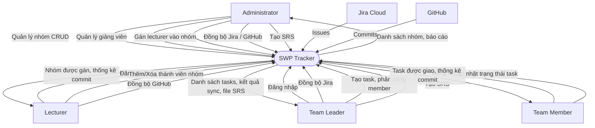

---

## 2. Activity Diagram (II.5.3)

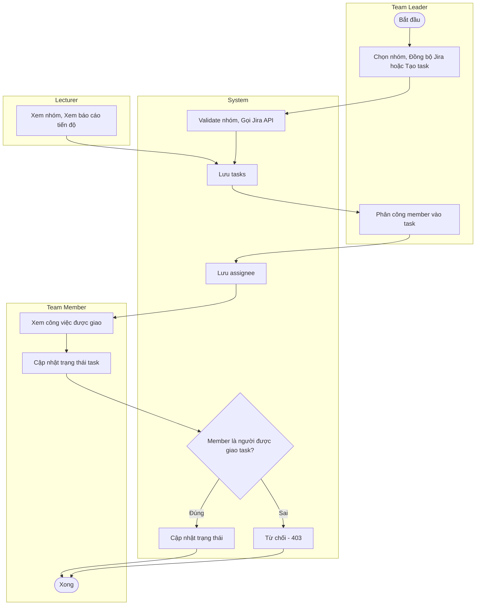

---

## 3. State Diagram – Task (III.2)

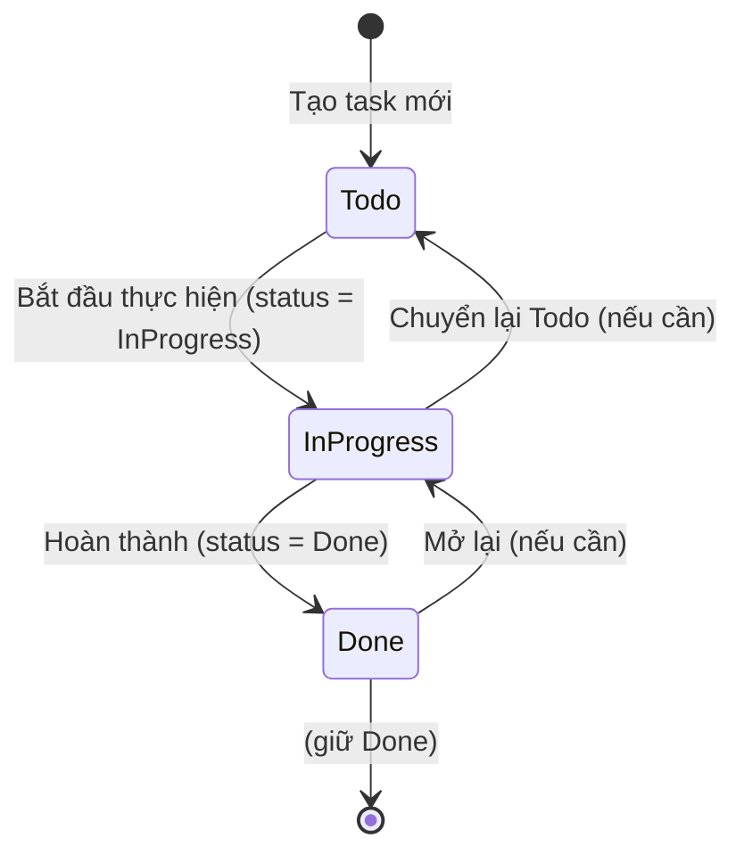

---

## 4. Sequence Diagrams (III.1.1) – 11 UC

### 4.1 UC-01 Đăng nhập

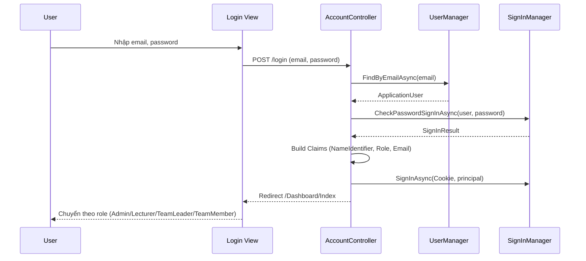

### 4.2 UC-08 Cập nhật trạng thái task

```mermaid
sequenceDiagram
    participant M as Team Member
    participant V as TeamMember View
    participant TC as TaskController
    participant DB as AppDbContext

    M->>V: Chọn trạng thái (Todo/Working/Done)
    V->>TC: PUT /api/tasks/{id}/status { status }
    TC->>DB: FirstOrDefaultAsync(task)
    DB-->>TC: TaskItem
    TC->>TC: Check: Member chỉ sửa task được giao cho mình
    alt AssigneeUserId != currentUser
        TC-->>V: 403 Forbid
    else OK
        TC->>DB: task.Status = req.Status; SaveChangesAsync()
        DB-->>TC: saved
        TC-->>V: 200 TaskResponse
    end
    V-->>M: Cập nhật badge & thống kê
```

### 4.3 UC-06 Đồng bộ Jira

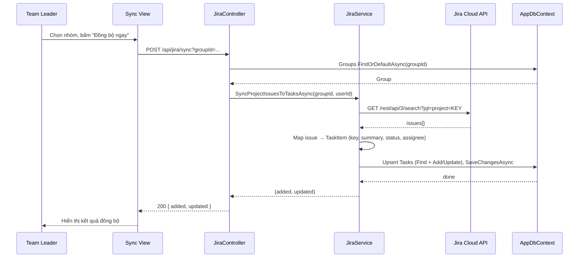

### 4.4 UC-02 Quản lý nhóm CRUD

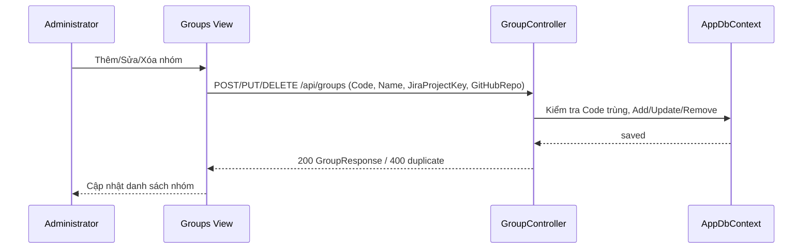

### 4.5 UC-03 Quản lý giảng viên

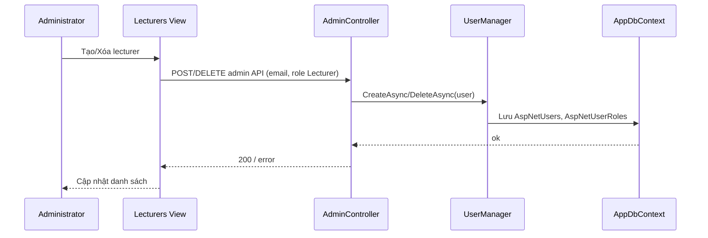

### 4.6 UC-04 Gán giảng viên vào nhóm

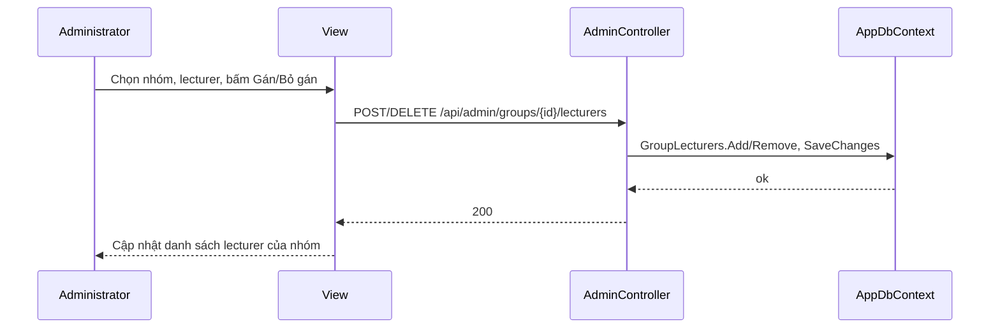

### 4.7 UC-05 Thêm/Xóa thành viên nhóm

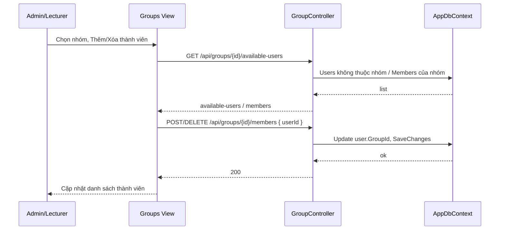

### 4.8 UC-07 Quản lý công việc / Phân công task

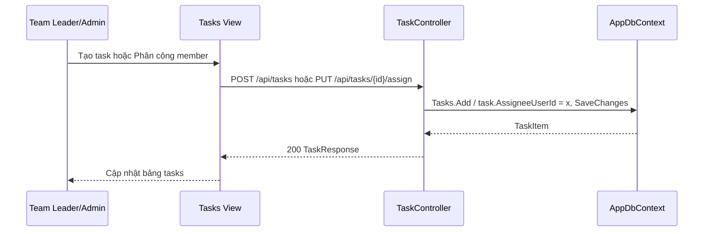

### 4.9 UC-09 Tạo SRS

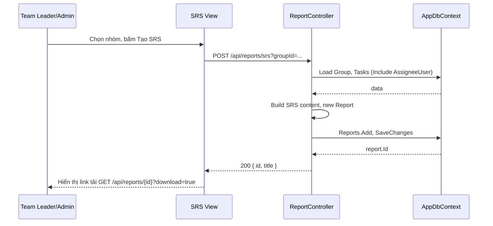

### 4.10 UC-10 Đồng bộ GitHub

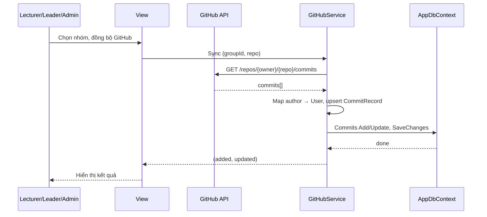

### 4.11 UC-11 Xem thống kê commit / báo cáo

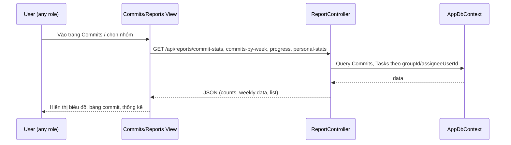

---

## 5. Communication Diagrams (III.1.2) – 11 UC

### 5.1 UC-01 Đăng nhập

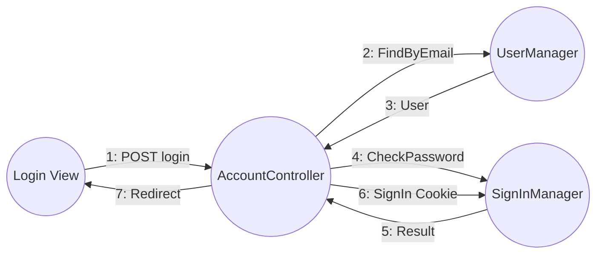

### 5.2 UC-02 Quản lý nhóm

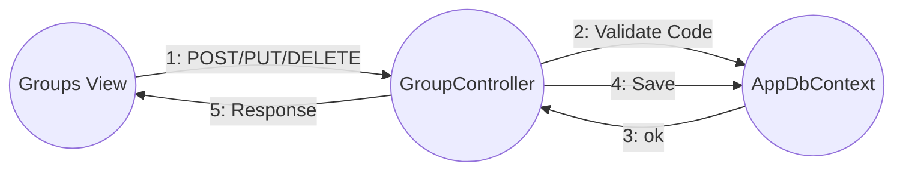

### 5.3 UC-03 Quản lý giảng viên

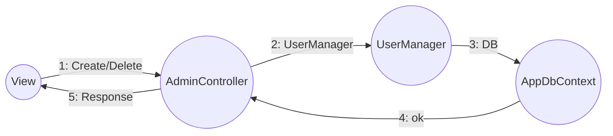

### 5.4 UC-04 Gán lecturer vào nhóm

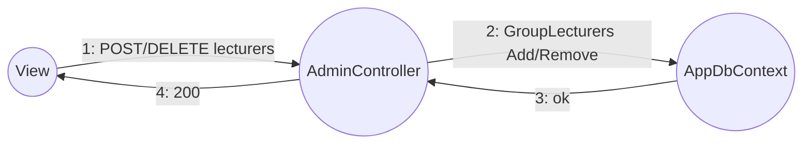

### 5.5 UC-05 Thêm/Xóa thành viên nhóm

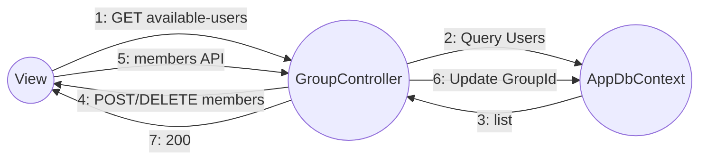

### 5.6 UC-06 Đồng bộ Jira

```mermaid
flowchart LR
    V((Sync View)) -->|1: POST sync| J((JiraController))
    J -->|2: SyncAsync| S((JiraService))
    S -->|3: GET search| API((Jira API))
    API -->|4: issues| S
    S -->|5: Upsert| D((AppDbContext))
    D -->|6: done| S
    S -->|7: (added,updated)| J
    J -->|8: JSON| V
```

### 5.7 UC-07 Quản lý công việc

```mermaid
flowchart LR
    V((Tasks View)) -->|1: POST task / PUT assign| TC((TaskController))
    TC -->|2: Load Group, Validate| DB((AppDbContext))
    DB -->|3: data| TC
    TC -->|4: Add/Update Task| DB
    TC -->|5: TaskResponse| V
```

### 5.8 UC-08 Cập nhật trạng thái task

```mermaid
flowchart LR
    subgraph " :Team Member"
        A((View))
    end
    subgraph " :API"
        B((TaskController))
    end
    subgraph " :Data"
        C((AppDbContext))
    end

    A -->|"1: PUT status"| B
    B -->|"2: Load task"| C
    C -->|"3: TaskItem"| B
    B -->|"4: Update, Save"| C
    C -->|"5: ok"| B
    B -->|"6: TaskResponse"| A
```

### 5.9 UC-09 Tạo SRS

```mermaid
flowchart LR
    V((SRS View)) -->|1: POST srs| RC((ReportController))
    RC -->|2: Load Group, Tasks| DB((AppDbContext))
    DB -->|3: data| RC
    RC -->|4: Build content, Add Report| DB
    DB -->|5: id| RC
    RC -->|6: { id, title }| V
    V -->|7: GET report download| RC
```

### 5.10 UC-10 Đồng bộ GitHub

```mermaid
flowchart LR
    V((View)) -->|1: Sync| GS((GitHubService))
    GS -->|2: GET commits| API((GitHub API))
    API -->|3: commits[]| GS
    GS -->|4: Map, Upsert Commits| DB((AppDbContext))
    DB -->|5: ok| GS
    GS -->|6: result| V
```

### 5.11 UC-11 Xem thống kê commit / báo cáo

```mermaid
flowchart LR
    V((Commits View)) -->|1: GET commit-stats, commits-by-week, progress| RC((ReportController))
    RC -->|2: Query Commits, Tasks| DB((AppDbContext))
    DB -->|3: data| RC
    RC -->|4: JSON| V
```
