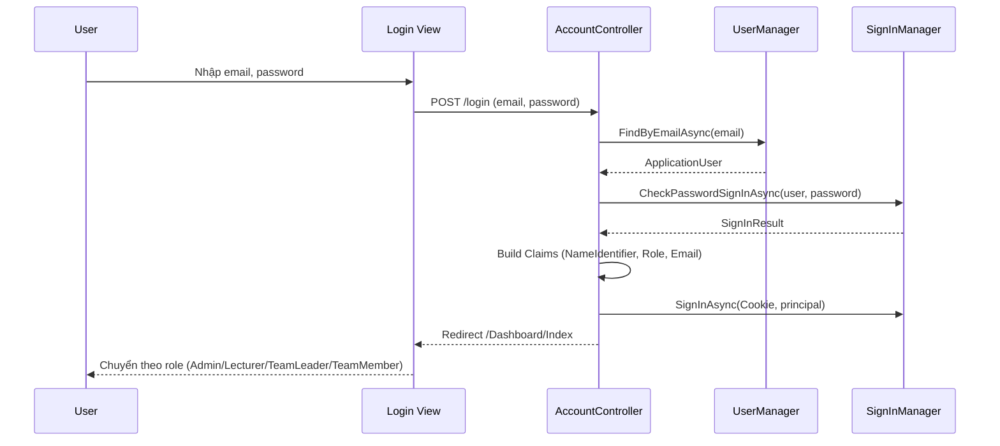
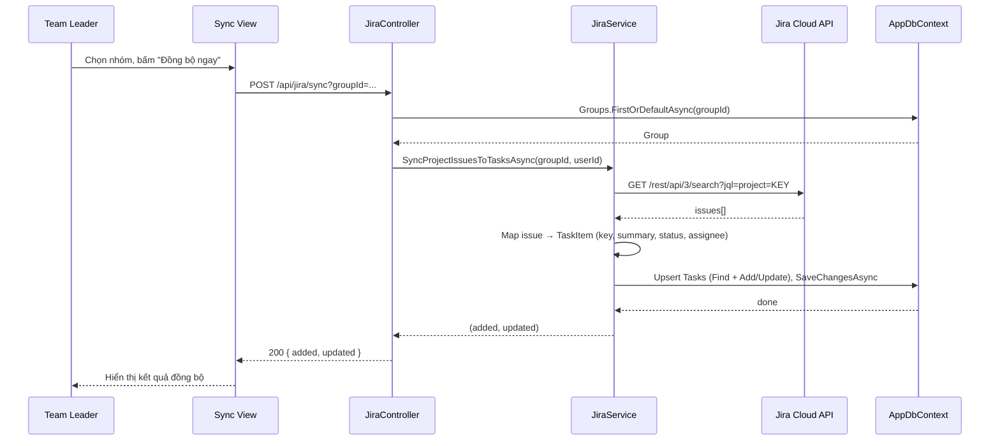
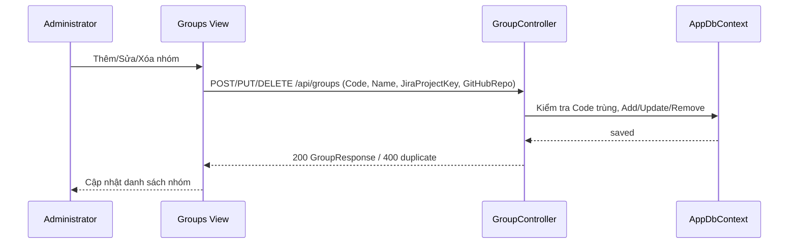
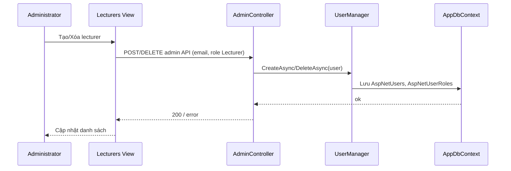
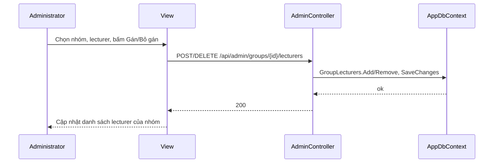
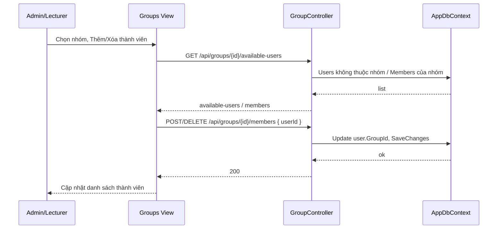
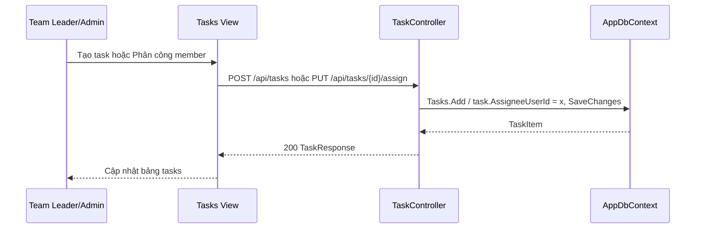
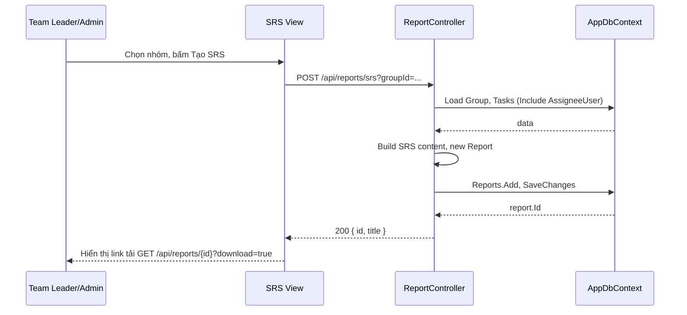
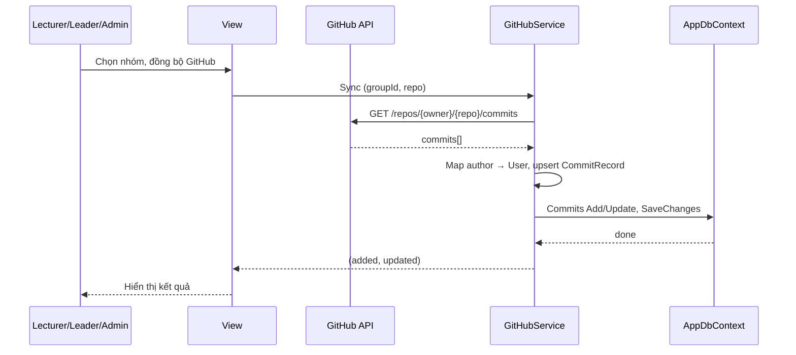
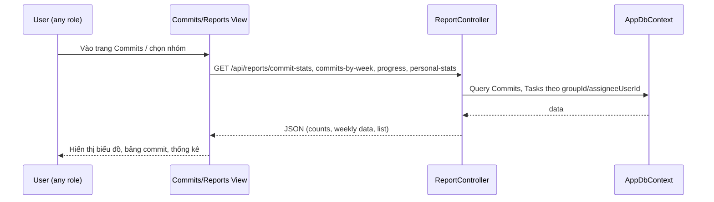

# Sequence Diagrams – Code cho mermaid.ai

Copy từng khối code dưới đây (không lấy dòng ```mermaid và ```) và dán vào [mermaid.ai](https://mermaid.ai) để xem hình. Hoặc copy nguyên cả khối kể cả ```mermaid và ``` nếu mermaid.ai chấp nhận.

---

## 1. UC-01 Đăng nhập



---

## 2. UC-08 Cập nhật trạng thái task

```mermaid
sequenceDiagram
    participant M as Team Member
    participant V as TeamMember View
    participant TC as TaskController
    participant DB as AppDbContext

    M->>V: Chọn trạng thái (Todo/Working/Done)
    V->>TC: PUT /api/tasks/{id}/status { status }
    TC->>DB: FirstOrDefaultAsync(task)
    DB-->>TC: TaskItem
    TC->>TC: Check: Member chỉ sửa task được giao cho mình
    alt AssigneeUserId != currentUser
        TC-->>V: 403 Forbid
    else OK
        TC->>DB: task.Status = req.Status; SaveChangesAsync()
        DB-->>TC: saved
        TC-->>V: 200 TaskResponse
    end
    V-->>M: Cập nhật badge & thống kê
```

---

## 3. UC-06 Đồng bộ Jira



---

## 4. UC-02 Quản lý nhóm CRUD



---

## 5. UC-03 Quản lý giảng viên



---

## 6. UC-04 Gán giảng viên vào nhóm



---

## 7. UC-05 Thêm/Xóa thành viên nhóm



---

## 8. UC-07 Quản lý công việc / Phân công task



---

## 9. UC-09 Tạo SRS



---

## 10. UC-10 Đồng bộ GitHub



---

## 11. UC-11 Xem thống kê commit / báo cáo


